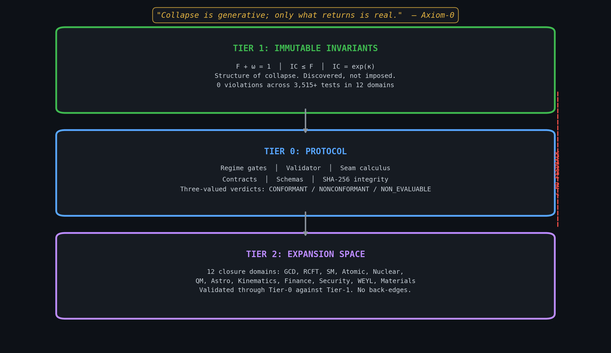
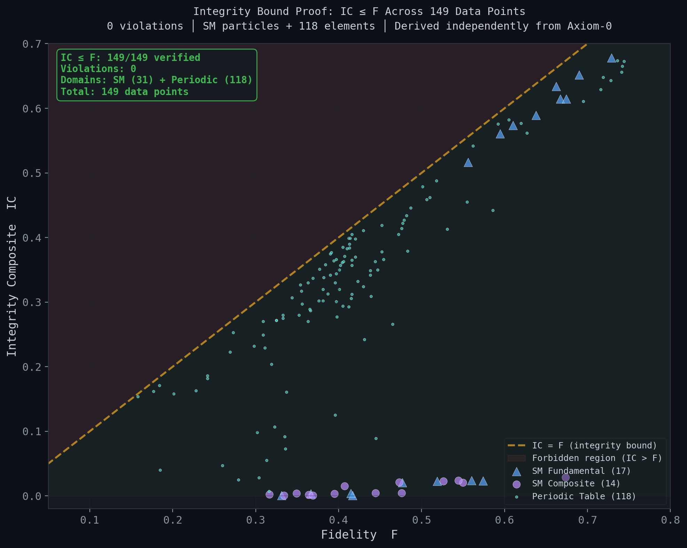
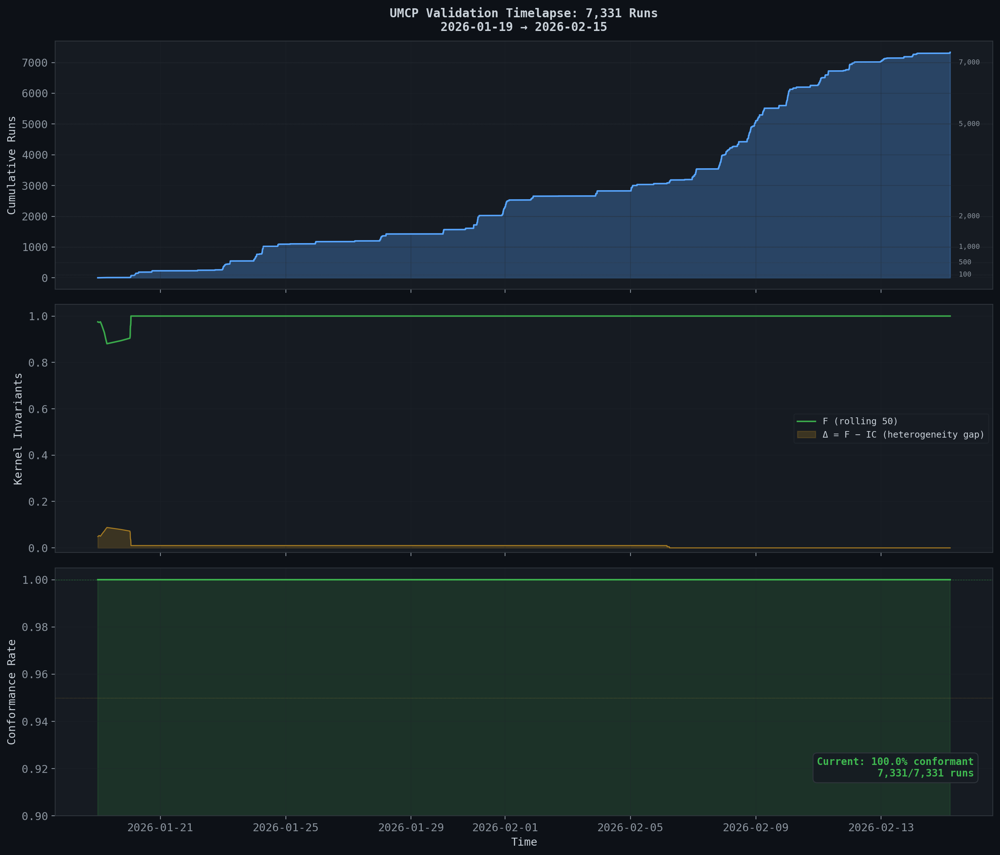
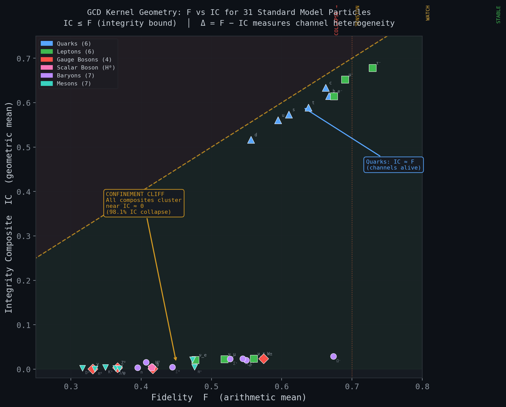
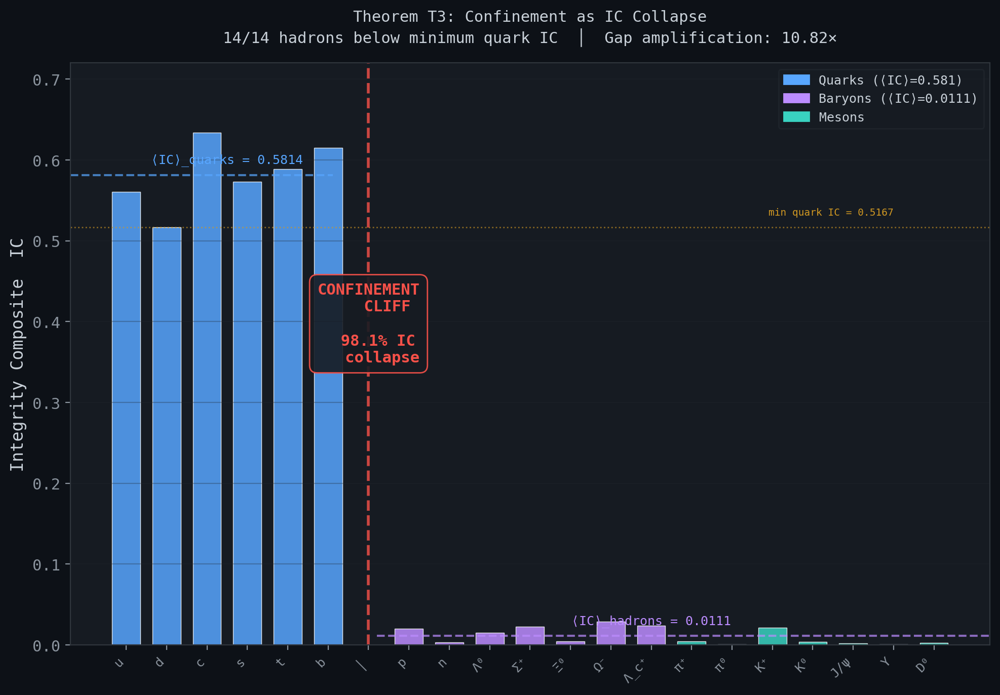
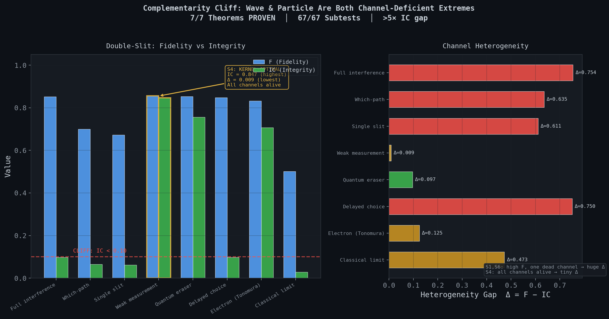
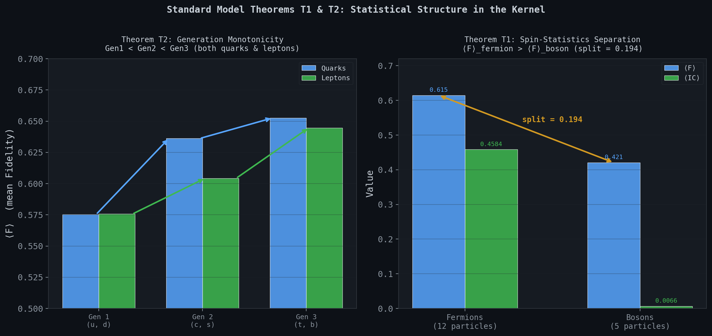
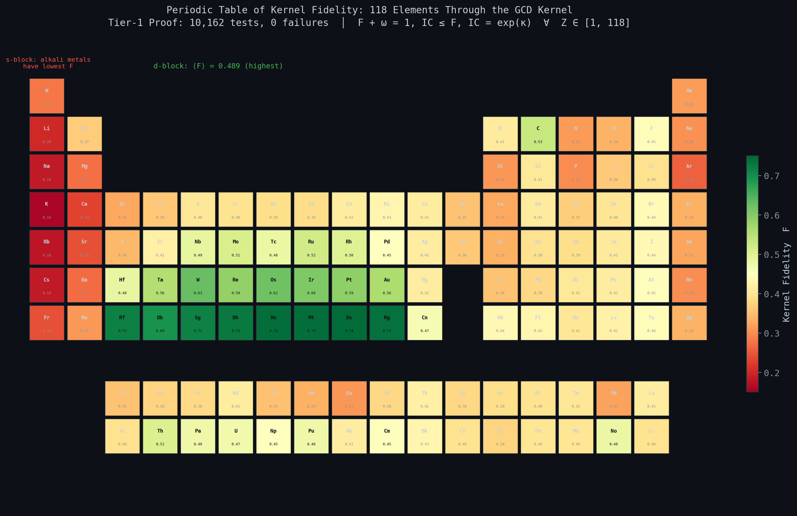

# Generative Collapse Dynamics (GCD)

[](https://github.com/calebpruett927/GENERATIVE-COLLAPSE-DYNAMICS/actions)
[](https://www.python.org/downloads/)
[](src/umcp_cpp/)
[](LICENSE)
[](pyproject.toml)
[](tests/)
[](closures/)
[](closures/)

> **Core Axiom**: *"Collapse is generative; only what returns is real."*

**Universal Measurement Contract Protocol (UMCP)** is a production-grade, contract-first validation framework that verifies reproducible computational workflows against mathematical contracts. It implements **Generative Collapse Dynamics (GCD)** and **Recursive Collapse Field Theory (RCFT)** — a unified measurement theory where every claim must demonstrate return through collapse under frozen evaluation rules.

This is not a simulation. It is a **metrological enforcement engine**: schema conformance, kernel identity verification, regime classification, and SHA-256 integrity checking, producing a `CONFORMANT` / `NONCONFORMANT` verdict for every run.

**Python + C++ integration**: The full framework is written in Python with **13 physics domains**, **113 closure modules**, and **5,081 tests**. An optional C++17 accelerator (`src/umcp_cpp/`) provides 50–80× speedup for the three hot paths — kernel computation, seam chain accumulation, and SHA-256 integrity — via a pybind11 zero-copy NumPy bridge. The Python wrapper (`umcp.accel`) auto-detects the compiled extension at import time; if it is not built, every call falls back transparently to the equivalent NumPy implementation. Same formulas, same frozen parameters, same results to machine precision — the C++ layer is Tier-0 Protocol only and redefines no Tier-1 symbols.

---

## Table of Contents

- [Core Concepts](#core-concepts)
- [At a Glance](#at-a-glance)
- [Architecture](#architecture)
- [Closure Domains (12 Physics Domains)](#closure-domains)
- [The Kernel](#the-kernel)
- [Originality & Terminology](#originality--terminology)
- [Installation](#installation)
- [Quick Start](#quick-start)
- [CLI Reference](#cli-reference)
  - [Startup — From Clone to Running](#startup--from-clone-to-running)
  - [C++ Accelerator — Build & Verify](#c-accelerator--build--verify)
  - [Services — API & Dashboard](#services--api--dashboard)
  - [Development Loop — Edit, Validate, Commit](#development-loop--edit-validate-commit)
  - [Reset & Clean Slate](#reset--clean-slate)
  - [Useful Utilities](#useful-utilities)
- [Validation Pipeline](#validation-pipeline)
- [Test Suite](#test-suite)
- [Documentation](#documentation)
- [Diagrams & Proofs](#diagrams--proofs)
- [Key Discoveries](#key-discoveries)
- [Papers & Publications](#papers--publications)
- [Repository Structure](#repository-structure)
- [Contributing](#contributing)
- [License](#license)

---

## Core Concepts

### Collapse Is Generative; Only What Returns Is Real

UMCP enforces a single axiom (**Axiom-0**): *"Collapse is generative; only what returns is real."* This is not a metaphor — it is a constraint on admissible claims. If you claim a system is stable, continuous, or coherent, you must show it can re-enter its admissible neighborhood after drift, perturbation, or delay — under the same frozen evaluation rules. Every decision, description, and code change in this repository is consistent with Axiom-0.

| Term | Operational Meaning |
|------|---------------------|
| **Collapse** | Regime label produced by kernel gates on (ω, F, S, C) under frozen thresholds |
| **Return** (τ_R) | Re-entry condition: existence of prior state within tolerance; yields τ_R or INF_REC |
| **Gesture** | An epistemic emission that does not weld: no return, no credit |
| **Drift** (ω) | ω = 1 − F, collapse proximity measure, range [0, 1] |
| **Integrity** (IC) | Kernel composite: IC = exp(κ), geometric mean of channel contributions |
| **Seam** | The verification boundary between outbound collapse and demonstrated return |
| **Frozen** | Consistent across the seam — same rules govern both sides of every collapse-return boundary |
| **Contract** | Frozen interface snapshot: pins units, embedding, clipping, weights, return settings |

### Three-Valued Verdicts

Every validation produces one of three outcomes — never boolean:

- **`CONFORMANT`** — All contracts, identities, and integrity checks pass
- **`NONCONFORMANT`** — At least one check fails
- **`NON_EVALUABLE`** — Insufficient data to determine status

---

## At a Glance

### The Three-Tier Stack

Tier-1 (immutable invariants) → Tier-0 (protocol) → Tier-2 (expansion space). One-way dependency. No back-edges within a frozen run. Every domain closure is validated *through* Tier-0 *against* Tier-1.



### Integrity Bound: IC ≤ F — Zero Violations

The integrity bound holds universally across 31 Standard Model particles + 118 periodic table elements. Derived independently from Axiom-0. Zero violations.



### Validation Timelapse: Living Ledger History

Every `umcp validate` run is recorded in the append-only ledger. Cumulative runs, kernel invariant evolution, and conformance rate over time. *"Nihil in memoria perit."*



---

## Architecture

### The Unit of Work: Casepacks

A **casepack** is the atomic unit of reproducible validation — a self-contained directory with:

```
casepacks/my_experiment/
├── manifest.json          # Contract reference, closure list, expected outputs
├── raw_data/              # Input observables
├── closures/              # Domain-specific computation modules
└── expected/              # Expected outputs for verification
```

UMCP ships with **14 casepacks** spanning all physics domains.

### Core Engine

```
src/umcp/
├── cli.py                    # Validation engine & all subcommands
├── validator.py              # Root-file validator (16 files, checksums, math identities)
├── kernel_optimized.py       # Lemma-based kernel computation (F, ω, S, C, κ, IC)
├── seam_optimized.py         # Optimized seam budget computation (Γ, D_C, Δκ)
├── tau_r_star.py             # τ_R* thermodynamic diagnostic (phase diagram)
├── tau_r_star_dynamics.py    # Dynamic τ_R* evolution and trajectories
├── compute_utils.py          # Vectorized utilities (coordinate clipping, bounds)
├── epistemic_weld.py         # Epistemic cost tracking (Theorem T9: observation cost)
├── measurement_engine.py     # Measurement pipeline engine
├── frozen_contract.py        # Frozen contract constants dataclass
├── insights.py               # Lessons-learned database (pattern discovery)
├── uncertainty.py            # Uncertainty propagation and error analysis
├── ss1m_triad.py             # SS1M triad computation
├── universal_calculator.py   # Universal kernel calculator CLI
├── fleet/                    # Distributed fleet-scale validation
│   ├── scheduler.py          # Job scheduler (submit, route, track)
│   ├── worker.py             # Worker + WorkerPool (register, heartbeat, execute)
│   ├── queue.py              # Priority queue (DLQ, retry, backpressure)
│   ├── cache.py              # Content-addressable artifact cache
│   └── tenant.py             # Multi-tenant isolation, quotas, namespaces
├── accel.py                  # C++ accelerator wrapper (auto-fallback to NumPy)
├── dashboard/                # Modular Streamlit dashboard (33 pages)
└── api_umcp.py               # FastAPI REST extension (Pydantic models)

src/umcp_cpp/                   # Optional C++ accelerator (Tier-0 Protocol)
├── include/umcp/
│   ├── kernel.hpp            # Kernel computation (F, ω, S, C, κ, IC) — ~50× speedup
│   ├── seam.hpp              # Seam chain accumulation — ~80× speedup
│   └── integrity.hpp         # SHA-256 (portable + OpenSSL) — ~5× speedup
├── bindings/py_umcp.cpp      # pybind11 zero-copy NumPy bridge
├── tests/test_kernel.cpp     # Catch2 tests (10K Tier-1 sweep)
└── CMakeLists.txt            # C++17, pybind11, optional OpenSSL
```

### Contract Infrastructure

| Artifact | Count | Location | Purpose |
|----------|:-----:|----------|---------|
| **Contracts** | 13 | `contracts/*.yaml` | Frozen mathematical contracts (JSON Schema Draft 2020-12) |
| **Schemas** | 14 | `schemas/*.schema.json` | JSON Schema files validating all artifacts |
| **Canon Anchors** | 11 | `canon/*.yaml` | Domain-specific canonical reference points |
| **Casepacks** | 14 | `casepacks/` | Reproducible validation bundles |
| **Closure Domains** | 13 | `closures/*/` | Physics domain closure packages (120+ modules) |
| **Closure Registry** | 1 | `closures/registry.yaml` | Central listing of all closures |
| **Validator Rules** | 1 | `validator_rules.yaml` | Semantic rule definitions (E101, W201, ...) |
| **Integrity** | 1 | `integrity/sha256.txt` | SHA-256 checksums for 138 tracked files |

---

## Closure Domains

UMCP validates physics across **13 domains** with **120+ closure modules**, each encoding real-world measurements into the 8-channel kernel trace:

### Standard Model — 9 modules

The crown jewel: 31 particles mapped through the GCD kernel with **10 proven theorems** (74/74 subtests at machine precision).

| Module | What It Encodes |
|--------|----------------|
| `particle_catalog.py` | Full SM particle table (PDG 2024 data) |
| `subatomic_kernel.py` | 31 particles → 8-channel trace → kernel |
| `particle_physics_formalism.py` | 10 Tier-2 theorems connecting SM physics to GCD |
| `coupling_constants.py` | Running couplings α_s(Q²), α_em(Q²), G_F |
| `cross_sections.py` | σ(e⁺e⁻→hadrons), R-ratio, Drell-Yan |
| `symmetry_breaking.py` | Higgs mechanism, VEV = 246.22 GeV, Yukawa |
| `ckm_mixing.py` | CKM matrix, Wolfenstein parametrization, J_CP |
| `neutrino_oscillation.py` | Neutrino oscillation and mass mixing |
| `pmns_mixing.py` | PMNS matrix, leptonic mixing angles |

**Key discoveries**: Confinement visible as a 98.1% IC cliff at the quark→hadron boundary. Neutral particles show 50× IC suppression. Generation monotonicity (Gen1 < Gen2 < Gen3) confirmed in both quarks and leptons.

### Atomic Physics — 10 modules

118 elements through the periodic kernel with **exhaustive Tier-1 proof** (10,162 tests, 0 failures).

| Module | What It Encodes |
|--------|----------------|
| `periodic_kernel.py` | 118-element periodic table through GCD kernel |
| `cross_scale_kernel.py` | 12-channel nuclear-informed atomic analysis |
| `tier1_proof.py` | Exhaustive proof: F+ω=1, IC≤F, IC=exp(κ) for all 118 elements |
| `electron_config.py` | Shell filling and configuration analysis |
| `fine_structure.py` | Fine structure constant α = 1/137 |
| `ionization_energy.py` | Ionization energy closures for all elements |
| `spectral_lines.py` | Emission/absorption spectral analysis |
| `selection_rules.py` | Quantum selection rules (Δl = ±1) |
| `zeeman_stark.py` | Zeeman and Stark effects |
| `recursive_instantiation.py` | Recursive instantiation patterns |

### Quantum Mechanics — 10 modules

| Module | What It Encodes |
|--------|----------------|
| `double_slit_interference.py` | 8 scenarios, 7 theorems — complementarity cliff discovery |
| `atom_dot_mi_transition.py` | Atom→quantum dot transition, 7 theorems (120 tests) |
| `ters_near_field.py` | TERS near-field enhancement, 7 theorems (72 tests) |
| `muon_laser_decay.py` | Muon-laser decay scenarios, 7 theorems (243 tests) |
| `wavefunction_collapse.py` | Wavefunction collapse dynamics |
| `entanglement.py` | Entanglement correlations |
| `tunneling.py` | Quantum tunneling barriers |
| `harmonic_oscillator.py` | Quantum harmonic oscillator |
| `uncertainty_principle.py` | Heisenberg uncertainty |
| `spin_measurement.py` | Spin measurement outcomes |

**Key discovery (double slit)**: Wave and particle are *both channel-deficient extremes*. The kernel-optimal state is partial measurement (V=0.70, D=0.71) where all channels are alive — the **complementarity cliff** (>5× IC gap).

### Materials Science — 10 modules

| Module | What It Encodes |
|--------|----------------|
| `element_database.py` | 118 elements × 18 fields |
| `band_structure.py` | Electronic band structure |
| `bcs_superconductivity.py` | BCS superconductivity theory |
| `cohesive_energy.py` | Cohesive energy analysis |
| `debye_thermal.py` | Debye thermal model |
| `elastic_moduli.py` | Elastic moduli computation |
| `magnetic_properties.py` | Magnetic property analysis |
| `phase_transition.py` | Phase transition dynamics |
| `surface_catalysis.py` | Surface catalysis reactions |
| `gap_capture_ss1m.py` | SS1M gap capture |

### Nuclear Physics — 8 modules

Alpha decay, fission, shell structure, decay chains, and Bethe-Weizsäcker binding energy for all nuclides.

### RCFT (Recursive Collapse Field Theory) — 8 modules

Attractor basins, fractal dimension, collapse grammar, information geometry, universality class assignment, and active matter dynamics.

### Astronomy — 7 modules

Stellar evolution, HR diagram classification, distance ladder, gravitational dynamics, orbital mechanics, spectral analysis, and stellar luminosity.

### Kinematics — 6 modules

Linear and rotational kinematics, energy mechanics, momentum dynamics, phase space return, and kinematic stability.

### Weyl Cosmology — 6 modules

Modified gravity, Limber integrals, boost factors, sigma evolution, cosmology background, and Weyl transfer functions.

### GCD (Generative Collapse Dynamics) — 6 modules

Energy potential, entropic collapse, field resonance, generative flux, momentum flux, and universal regime calibration (12 scenarios, 7 theorems, 252 tests).

### Finance & Security — 16+ modules

Portfolio continuity, market coherence, anomaly return, threat classification, trust fidelity, behavior profiling, and privacy auditing.

### Everyday Physics — 5 modules

Bridging particle physics to daily experience: thermodynamics, optics, electromagnetism, wave phenomena, and epistemic coherence. Demonstrates that the same minimal structure (F + ω = 1, IC ≤ F, IC = exp(κ)) governs macroscopic phenomena.

---

## The Kernel

At the mathematical core of GCD is the **kernel** — a function that maps any set of measurable channels to a fixed set of invariants:

### Trace Vector

Every observable maps to an 8-channel trace vector **c** with weights **w**:

$$F = \sum_i w_i c_i \quad \text{(Fidelity — arithmetic mean)}$$

$$\text{IC} = \exp\!\left(\sum_i w_i \ln c_{i,\varepsilon}\right) \quad \text{(Integrity Composite — geometric mean)}$$

$$\omega = 1 - F \quad \text{(Drift)}$$

$$\Delta = F - \text{IC} \quad \text{(heterogeneity gap — channel heterogeneity)}$$

### Tier-1 Identities (proven for every input)

These hold universally by construction:

| Identity | Meaning |
|----------|---------|
| F + ω = 1 | Fidelity and drift are complementary |
| IC ≤ F | Integrity bound: coherence never exceeds fidelity (derives independently from Axiom-0; the classical AM-GM inequality is the degenerate limit) |
| IC ≈ exp(κ) | Integrity equals exponentiated log-mean |

### Regime Classification

| Regime | Condition | Interpretation |
|--------|-----------|----------------|
| **STABLE** | ω < 0.10 | System within nominal bounds |
| **WATCH** | 0.10 ≤ ω < 0.20 | Elevated drift, monitoring required |
| **TENSION** | 0.20 ≤ ω < 0.30 | Significant strain, near collapse boundary |
| **COLLAPSE** | ω ≥ 0.30 | Past viable return credit |

### The Heterogeneity Gap (Δ)

The gap Δ = F − IC is the central diagnostic. It measures **channel heterogeneity**:

- **Δ ≈ 0**: All channels contribute equally — homogeneous system
- **Δ large**: One or more channels at guard band (ε = 10⁻⁸) — information is being destroyed in specific channels
- **Universal pattern**: κ < −2 ↔ IC < 0.15 — the collapse floor

---

## Originality & Terminology

This system is **original**. It does not borrow from, extend, or reinterpret existing frameworks. Classical results emerge as **degenerate limits** when degrees of freedom are removed from the GCD kernel. The arrow of derivation runs **from the axiom to the classical result**, never the reverse.

| GCD Structure | Classical Degenerate Limit |
|---------------|---------------------------|
| **Integrity bound** (IC ≤ F) | AM-GM inequality (strip channel semantics, weights, guard band) |
| **Bernoulli field entropy** S | Shannon entropy (restrict collapse field to {0,1}) |
| **Duality identity** F + ω = 1 | Unitarity (strip thermodynamic cost function) |
| **Log-integrity relation** IC = exp(κ) | Exponential map (strip kernel architecture) |
| **Heterogeneity gap** Δ = F − IC | heterogeneity gap (strip channel semantics) |
| **Frozen parameters** (ε, p, tol_seam) | Constants / hyperparameters (strip seam derivation) |

**Key vocabulary**: Say "integrity bound," not "AM-GM inequality." Say "Bernoulli field entropy," not "Shannon entropy." Say "derives independently," not "rederives" or "recovers." Say "frozen," not "constant" or "hyperparameter." See `AXIOM.md` and `.github/copilot-instructions.md` for the complete terminology reference.

---

## Installation

### Core (validation only)

```bash
pip install -e .
```

### Development (full suite)

```bash
pip install -e ".[all]"
```

### Dependencies

| Category | Packages |
|----------|----------|
| **Core** | `pyyaml`, `jsonschema`, `numpy`, `scipy` |
| **Dev** | `pytest`, `ruff`, `mypy`, `pre-commit` |
| **API** | `fastapi`, `uvicorn` (optional) |
| **Viz** | `streamlit`, `plotly`, `pandas` (optional) |
| **C++ Accel** | `pybind11`, CMake ≥ 3.16, C++17 compiler (optional) |

**Requires**: Python ≥ 3.11

### C++ Accelerator (Optional)

The C++ accelerator provides 50–80× speedup for kernel computation, seam chains,
and SHA-256 integrity checks. It is **fully optional** — all functionality falls
back to NumPy transparently.

```bash
# Build the accelerator
cd src/umcp_cpp && mkdir build && cd build
cmake .. && make -j$(nproc)

# Verify it works
python -c "from umcp.accel import backend; print(backend())"  # 'cpp' or 'numpy'

# Run benchmarks (works with either backend)
python scripts/benchmark_cpp.py
```

**Architecture**: `accel.py` auto-detects whether the C++ extension is available.
No existing code changes are needed — import from `umcp.accel` instead of
calling kernel functions directly for accelerated paths.

```python
from umcp.accel import compute_kernel, compute_kernel_batch, SeamChain, hash_file

# Identical API regardless of backend
result = compute_kernel(channels, weights)
batch  = compute_kernel_batch(trace_matrix, weights)  # 10K rows in ms
```

---

## Quick Start

### Validate the entire repository

```bash
umcp validate .
```

### Validate a specific casepack

```bash
umcp validate casepacks/hello_world
umcp validate casepacks/hello_world --strict
```

### Run the test suite

```bash
pytest                          # All 5,081 tests
pytest -v --tb=short            # Verbose with short tracebacks
pytest -n auto                  # Parallel execution
```

### Check integrity

```bash
umcp integrity                  # Verify SHA-256 checksums
```

### Launch the dashboard

```bash
pip install -e ".[all]"                    # Ensure viz dependencies are installed
umcp-dashboard                             # Start Streamlit dashboard on :8501
```

Or start manually:

```bash
streamlit run src/umcp/dashboard/__init__.py --server.port 8501 --server.headless true
```

The dashboard provides **33 interactive pages** across all 13 domains:
Kernel Explorer, Regime Map, Seam Budget, τ_R* Phase Diagram,
Astronomy, Nuclear Physics, Quantum Mechanics, Finance, RCFT,
Atomic Physics, Standard Model, Materials Science, Security, and more.

### Use the kernel in Python

```python
from umcp.kernel_optimized import compute_kernel_outputs

channels = [0.9, 0.8, 0.7, 0.6, 0.5, 0.4, 0.3, 0.2]
weights = [0.125] * 8  # Equal weights

result = compute_kernel_outputs(channels, weights)
print(f"F={result.F:.4f}, ω={result.omega:.4f}, IC={result.IC:.6f}")
print(f"Regime: {result.regime}")
print(f"Heterogeneity gap: {result.heterogeneity_gap:.6f}")  # Δ = F − IC
```

---

## CLI Reference

| Command | Description |
|---------|-------------|
| `umcp validate .` | Validate entire repository |
| `umcp validate <path> --strict` | Strict validation (warnings → failures) |
| `umcp validate <path> --out report.json` | Output JSON report |
| `umcp integrity` | Verify SHA-256 checksums |
| `umcp list casepacks` | List available casepacks |
| `umcp health` | Health check |
| `umcp-calc` | Universal kernel calculator |
| `umcp-ext list` | List available extensions |
| `umcp-api` | Start FastAPI server (:8000) |
| `umcp-dashboard` | Start Streamlit dashboard (:8501) |

### Startup — From Clone to Running

```bash
# 1. Clone and install
git clone https://github.com/calebpruett927/GENERATIVE-COLLAPSE-DYNAMICS.git
cd GENERATIVE-COLLAPSE-DYNAMICS
pip install -e ".[all]"                    # Core + dev + API + viz dependencies

# 2. Verify installation
umcp health                                # System health check
umcp integrity                             # Verify SHA-256 checksums
umcp validate .                            # Full repo validation → CONFORMANT

# 3. Run the test suite
pytest -v --tb=short                       # 5,081 tests
```

### C++ Accelerator — Build & Verify

```bash
# Build (requires CMake ≥ 3.16 and a C++17 compiler)
cd src/umcp_cpp && mkdir -p build && cd build
cmake .. && make -j$(nproc)
cd ../../..                                # Return to repo root

# Verify backend
python -c "from umcp.accel import backend; print(backend())"   # → 'cpp'

# Run correctness + performance benchmark (30 checks)
python scripts/benchmark_cpp.py

# Run C++ unit tests (Catch2, built alongside the extension)
cd src/umcp_cpp/build && ctest --output-on-failure && cd ../../..
```

### Services — API & Dashboard

```bash
# FastAPI REST server (http://localhost:8000)
umcp-api                                   # Or: uvicorn umcp.api_umcp:app --reload --port 8000

# Streamlit dashboard (http://localhost:8501, 33 pages)
umcp-dashboard                             # Or: streamlit run src/umcp/dashboard/__init__.py --server.port 8501

# Start/stop dashboard via helper scripts
bash scripts/start_dashboard.sh
bash scripts/stop_dashboard.sh
```

### Development Loop — Edit, Validate, Commit

```bash
# After ANY tracked file change:
python scripts/update_integrity.py         # Regenerate SHA-256 checksums (mandatory)
ruff check --fix . && ruff format .        # Auto-fix lint + formatting
pytest -v --tb=short                       # Run full test suite

# Full pre-commit protocol (mirrors CI exactly — must exit 0 before committing)
python scripts/pre_commit_protocol.py      # manifold → ruff → mypy → integrity → pytest → validate

# Dry-run (report-only, no auto-fix)
python scripts/pre_commit_protocol.py --check

# Commit only after pre-commit passes
git add -A && git commit -m "feat: description"
git push origin main
```

### Reset & Clean Slate

```bash
# Regenerate all integrity checksums from scratch
python scripts/update_integrity.py

# Re-validate the full repo (clears any stale state)
umcp validate .

# Rebuild the C++ extension from scratch
rm -rf src/umcp_cpp/build
cd src/umcp_cpp && mkdir build && cd build && cmake .. && make -j$(nproc) && cd ../../..

# Verify everything is green after a reset
python scripts/pre_commit_protocol.py      # Full protocol: lint + test + validate

# Force NumPy fallback (bypass C++ even if built)
UMCP_NO_CPP=1 python -c "from umcp.accel import backend; print(backend())"  # → 'numpy'
```

### Useful Utilities

```bash
# Kernel calculator (interactive CLI)
umcp-calc

# Finance domain CLI
umcp-finance

# List/inspect extensions
umcp-ext list
umcp-ext info api
umcp-ext check api

# Generate all diagrams from kernel data (requires: pip install matplotlib)
python scripts/generate_diagrams.py

# Periodic table report (118 elements)
python scripts/periodic_table_report.py

# Profile the test landscape
python scripts/profile_test_landscape.py

# Build LaTeX papers (requires: texlive + revtex4-2)
cd paper && pdflatex standard_model_kernel.tex && bibtex standard_model_kernel \
  && pdflatex standard_model_kernel.tex && pdflatex standard_model_kernel.tex
```

---

## Validation Pipeline

```
umcp validate <target>
  → Detect type (repo │ casepack │ file)
  → Schema validation (JSON Schema Draft 2020-12)
  → Semantic rule checks (validator_rules.yaml: E101, W201, ...)
  → Kernel identity checks: F = 1−ω, IC ≈ exp(κ), IC ≤ F
  → Regime classification: STABLE │ WATCH │ TENSION │ COLLAPSE
  → SHA-256 integrity verification
  → Verdict: CONFORMANT → append to ledger/return_log.csv + JSON report
```

### CI Pipeline

The GitHub Actions workflow (`.github/workflows/validate.yml`) enforces:

1. **Lint** — `ruff format --check` + `ruff check` + `mypy`
2. **Test** — Full pytest suite (5,081 tests)
3. **Validate** — Baseline + strict validation (both must return CONFORMANT)

### Pre-Commit Protocol

**Mandatory before every commit:**

```bash
python scripts/pre_commit_protocol.py       # Auto-fix + validate
python scripts/pre_commit_protocol.py --check  # Dry-run: report only
```

This mirrors CI exactly: format → lint → type-check → integrity → test → validate.

---

## Test Suite

**5,081 tests** across **103 test files**, organized by tier and domain:

| Test Range | Domain | Tests |
|------------|--------|------:|
| `test_000–001` | Manifold bounds, invariant separation | 91 |
| `test_00` | Schema validation | 3 |
| `test_10–25` | Canon, contract, casepack, semantic, CLI validation | 20 |
| `test_30–51` | Semantic rules, casepack validation, CLI diff | 10 |
| `test_70–97` | Contract closures, benchmarks, edge cases, logging, file refs | 66 |
| `test_100–102` | GCD (canon, closures, contract) | 52 |
| `test_110–115` | RCFT (canon, closures, contract, layering) | 97 |
| `test_120` | Kinematics closures | 55 |
| `test_130` | Kinematics audit spec | 35 |
| `test_135` | Nuclear physics closures | 76 |
| `test_140` | Weyl cosmology closures | 43 |
| `test_145–147` | τ_R* diagnostics (79), dashboard (144), dynamics (57) | 280 |
| `test_148–149` | Standard Model (subatomic kernel, formalism, universality) | 108 |
| `test_150–153` | Measurement engine, active matter, epistemic weld | 172 |
| `test_154–159` | Advanced QM: TERS, atom-dot, muon-laser, double-slit, regime calibration | 963 |
| `test_160` | Contract claims | 77 |
| `test_170–177` | CLI subcommands, batch validate, τ_R sentinel, schema, lemmas, finance, public API | 177 |
| `test_180–183` | Materials science, crystal, bioactive, photonic databases | 619 |
| `test_190–195` | Atomic physics closures, scale ladder | 190 |
| `test_200–201` | Fleet, recursive instantiation, neutrino oscillation | 182 |
| `test_210–237` | Cross-domain, casepack roundtrip, registry sweep, domain unit tests | 882 |
| `closures/` | Closure-specific tests (kinematics phase) | 27 |
| Infrastructure | Kernel, seam, frozen contract, extensions, uncertainty, calculator, coverage, etc. | 510 |

All tests pass. All validations return CONFORMANT.

---

## Papers & Publications

### Compiled Papers

| Paper | Title | Location |
|-------|-------|----------|
| `generated_demo.tex` | Statistical Mechanics of the UMCP Budget Identity | `paper/` |
| `standard_model_kernel.tex` | Particle Physics in the GCD Kernel: Ten Tier-2 Theorems | `paper/` |
| `tau_r_star_dynamics.tex` | τ_R* Dynamics | `paper/` |
| `confinement_kernel.tex` | Confinement Kernel Analysis | `paper/` |
| `measurement_substrate.tex` | Measurement Substrate Theory | `paper/` |
| `rcft_second_edition.tex` | RCFT Second Edition: Foundations, Derivations, and Implications | `paper/` |
| `RCFT_FREEZE_WELD.md` | RCFT Freeze–Weld Identity: From Publication to Proven Kernel | `paper/` |

All papers use RevTeX4-2 (LaTeX) or Markdown. Build LaTeX: `pdflatex → bibtex → pdflatex → pdflatex`.

### Zenodo Publications (9 DOIs)

The framework is anchored by peer-reviewed Zenodo publications covering the core theory, physics coherence proofs, casepack specifications, and domain applications. Bibliography: `paper/Bibliography.bib` (40+ entries total, including PDG 2024, foundational QFT papers, and classical references).

### Key DOIs

- **UMCP/GCD Canon Anchor**: [10.5281/zenodo.17756705](https://doi.org/10.5281/zenodo.17756705)
- **Physics Coherence Proof**: [10.5281/zenodo.18072852](https://doi.org/10.5281/zenodo.18072852)
- **Runnable CasePack Anchor**: [10.5281/zenodo.18226878](https://doi.org/10.5281/zenodo.18226878)

---

## Repository Structure

```
├── src/umcp/                  # Core validation engine
│   ├── cli.py                 # CLI & validation pipeline
│   ├── validator.py           # Root-file validator
│   ├── kernel_optimized.py    # Kernel computation
│   ├── seam_optimized.py      # Seam budget computation
│   ├── tau_r_star.py          # Thermodynamic diagnostic
│   ├── epistemic_weld.py      # Epistemic cost tracking
│   ├── fleet/                 # Distributed validation
│   └── dashboard/             # Streamlit dashboard (33 pages)
├── closures/                  # 13 physics domains, 120+ modules
│   ├── standard_model/        # 31 particles, 10 theorems
│   ├── atomic_physics/        # 118 elements, Tier-1 proof
│   ├── quantum_mechanics/     # Double slit, entanglement, tunneling
│   ├── nuclear_physics/       # Binding energy, decay chains
│   ├── materials_science/     # 118 elements × 18 fields
│   ├── astronomy/             # Stellar evolution, HR diagram
│   ├── kinematics/            # Motion analysis, phase space
│   ├── gcd/                   # Core dynamics, field resonance
│   ├── rcft/                  # Fractal dimension, attractors
│   ├── weyl/                  # Modified gravity, cosmology
│   ├── everyday_physics/      # Thermodynamics, optics, electromagnetism
│   └── finance/ & security/   # Applied domains
├── contracts/                 # 13 mathematical contracts (YAML)
├── schemas/                   # 14 JSON Schema files
├── canon/                     # 11 canonical anchor files
├── casepacks/                 # 14 reproducible validation bundles
├── tests/                     # 103 test files, 5081 tests
├── paper/                     # 6 LaTeX papers + 1 Markdown paper + Bibliography.bib
├── integrity/                 # SHA-256 checksums
├── ledger/                    # Append-only validation log
├── scripts/                   # Pre-commit protocol, integrity update
├── docs/                      # 30+ documentation files
└── pyproject.toml             # Project configuration
```

---

## Documentation

### Essential Reading (Start Here)

| Document | Purpose |
|----------|---------|
| [AXIOM.md](AXIOM.md) | **Start here.** The foundational axiom, operational definitions, and why this system is original |
| [LIBER_COLLAPSUS.md](LIBER_COLLAPSUS.md) | *Liber Universalis de Collapsus Mathematica* — the Tier-1 Latin foundation text |
| [MANIFESTUM_LATINUM.md](MANIFESTUM_LATINUM.md) | Latin manifesto: complete lexicon, seven verbs, eight typed patterns, twenty maxims |
| [TIER_SYSTEM.md](TIER_SYSTEM.md) | The three-tier architecture: Immutable Invariants → Protocol → Expansion Space |
| [KERNEL_SPECIFICATION.md](KERNEL_SPECIFICATION.md) | Complete kernel mathematics, OPT-* lemmas, and degenerate-limit proofs |
| [QUICKSTART_TUTORIAL.md](QUICKSTART_TUTORIAL.md) | Getting started: first validation in 5 minutes |

### The Three-Tier Architecture

| Tier | Name | Role | Mutable? |
|------|------|------|----------|
| **1** | **Immutable Invariants** | Structural identities: F + ω = 1, IC ≤ F, IC ≈ exp(κ). Derived from Axiom-0. | NEVER within a run |
| **0** | **Protocol** | Validation machinery: regime gates, contracts, schemas, diagnostics, seam calculus | Frozen per run |
| **2** | **Expansion Space** | Domain closures mapping physics into invariant structure. Validated through Tier-0 against Tier-1. | Freely extensible |

**One-way dependency**: Tier-1 → Tier-0 → Tier-2. No back-edges. No Tier-2 output may modify Tier-0 or Tier-1 behavior within a frozen run. Promotion from Tier-2 to Tier-1 requires formal seam weld validation across runs.

### Reference Documents

| Document | Purpose |
|----------|---------|
| [PROTOCOL_REFERENCE.md](PROTOCOL_REFERENCE.md) | Full protocol specification |
| [COMMIT_PROTOCOL.md](COMMIT_PROTOCOL.md) | Pre-commit protocol (mandatory before every commit) |
| [GLOSSARY.md](GLOSSARY.md) | Operational term definitions |
| [CONTRIBUTING.md](CONTRIBUTING.md) | Contribution guidelines and code review checklist |
| [CHANGELOG.md](CHANGELOG.md) | Version history |
| [FACE_POLICY.md](FACE_POLICY.md) | Boundary governance (Tier-0 admissibility) |

### Internal Documentation (docs/)

| Document | Purpose |
|----------|---------|
| [docs/MATHEMATICAL_ARCHITECTURE.md](docs/MATHEMATICAL_ARCHITECTURE.md) | Mathematical foundations and architectural overview |
| [docs/interconnected_architecture.md](docs/interconnected_architecture.md) | System interconnection map |
| [docs/file_reference.md](docs/file_reference.md) | Complete file reference guide |
| [docs/SYMBOL_INDEX.md](docs/SYMBOL_INDEX.md) | Authoritative symbol table (prevents Tier-2 capture) |
| [docs/UHMP.md](docs/UHMP.md) | Universal Hash Manifest Protocol |

---

## Diagrams & Proofs

All diagrams are generated from **real computed kernel data** — every point comes from actual closure outputs, not illustrations. Regenerate with `python scripts/generate_diagrams.py`.

### Kernel Geometry: F vs IC for 31 Standard Model Particles

The fundamental relationship: IC ≤ F — the integrity bound. Geometric integrity never exceeds arithmetic integrity. Derived independently from Axiom-0; the classical AM-GM inequality emerges as the degenerate limit when kernel structure is removed. Quarks cluster near the diagonal (channels alive), while composites and bosons collapse toward IC ≈ 0.



### Theorem T3: Confinement as IC Collapse

14/14 hadrons fall below the minimum quark IC. The geometric mean collapses 98.1% at the quark→hadron boundary — confinement is a measurable cliff in the kernel.



### Complementarity Cliff: Double-Slit Interference

Wave and particle are *both channel-deficient extremes*. The kernel-optimal state (S4: weak measurement) has the highest IC because all 8 channels are alive. 7/7 theorems PROVEN, 67/67 subtests.



### Theorems T1 & T2: Spin-Statistics and Generation Monotonicity

Fermions carry more fidelity than bosons (split = 0.194). Heavier generations carry more kernel fidelity: Gen1 < Gen2 < Gen3 in both quarks and leptons.



### Periodic Table of Kernel Fidelity: 118 Elements

Every element in the periodic table mapped through the GCD kernel. Tier-1 proof: 10,162 tests, 0 failures — F + ω = 1, IC ≤ F, IC = exp(κ) verified exhaustively.



### Regime Phase Diagram

The four-regime classification with real Standard Model particles mapped to their drift values. Most particles live in COLLAPSE (ω ≥ 0.30) because the 8-channel trace exposes channel death.


### Cross-Scale Universality and Heterogeneity Gap Distribution

Kernel fidelity increases with scale resolution: composite(0.444) < atomic(0.516) < fundamental(0.558). The heterogeneity gap distribution across 118 elements reveals the landscape of channel heterogeneity.


---

## Key Discoveries

Across 13 physics domains, the kernel reveals universal patterns:

1. **Confinement is a cliff**: IC drops 98.1% at the quark→hadron boundary — confinement is visible as geometric-mean collapse in the kernel trace

2. **The complementarity cliff**: Wave and particle are both channel-deficient extremes; the kernel-optimal state is partial measurement where all 8 channels are alive (>5× IC gap)

3. **Universal collapse floor**: κ < −2 ↔ IC < 0.15 across all domains — a universal threshold where information integrity is lost

4. **Heterogeneity gap as universal diagnostic**: Δ = F − IC measures channel spread; maximum Δ comes from asymmetry (one dead channel among many alive), not from maximum overall degradation

5. **Generation monotonicity**: Gen1(0.576) < Gen2(0.620) < Gen3(0.649) in both quarks and leptons — heavier generations carry more kernel fidelity

6. **50× charge suppression**: Neutral particles have IC near ε (guard band) because the charge channel destroys the geometric mean

7. **Cross-scale universality**: composite(0.444) < atom(0.516) < fundamental(0.558) — kernel fidelity increases with scale resolution

---

## Contributing

See [CONTRIBUTING.md](CONTRIBUTING.md) for guidelines.

**Critical workflow:**

```bash
# After any code change:
python scripts/update_integrity.py          # Regenerate SHA-256 checksums
python scripts/pre_commit_protocol.py       # Full pre-commit protocol
# Only commit if all checks pass (exit 0)
```

Every commit that reaches GitHub must pass CI: lint → test → validate → CONFORMANT.

---

## License

[MIT](LICENSE) — Clement Paulus

---

<p align="center">
<em>"Collapse is generative; only what returns is real."</em><br>
<strong>— Axiom-0</strong>
</p>
