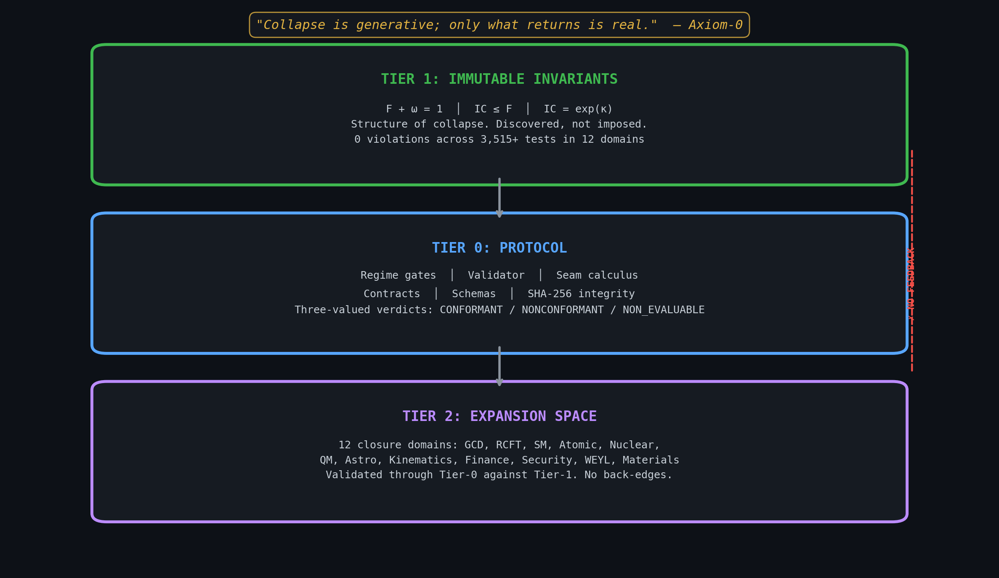
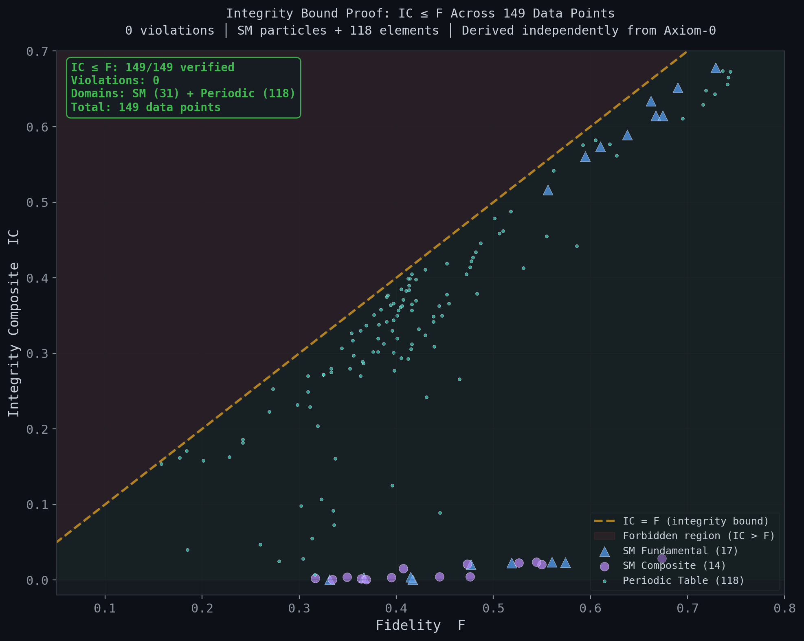
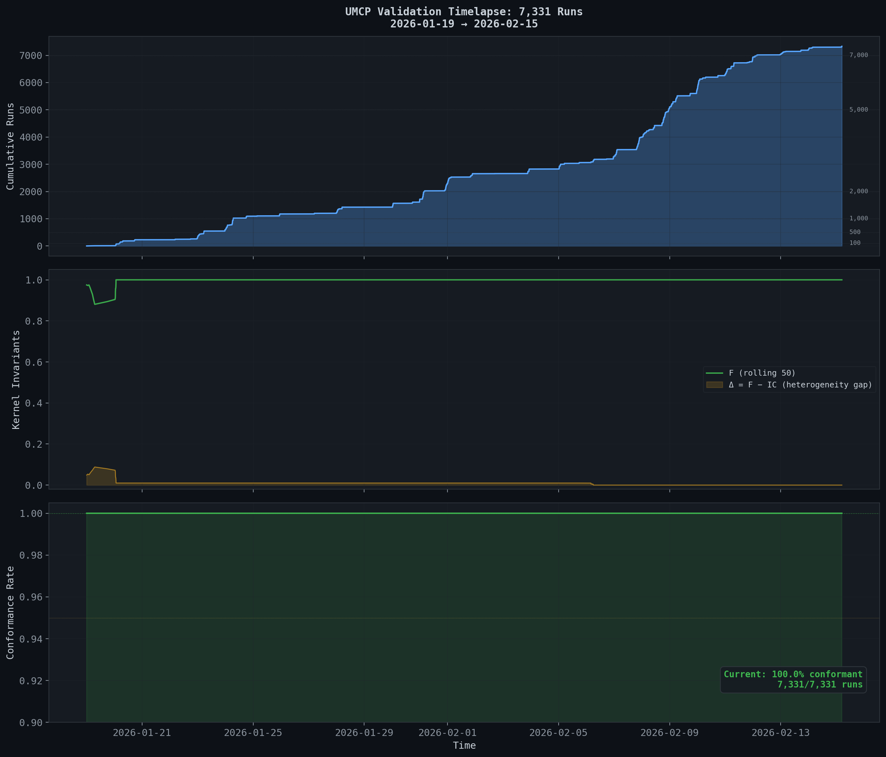
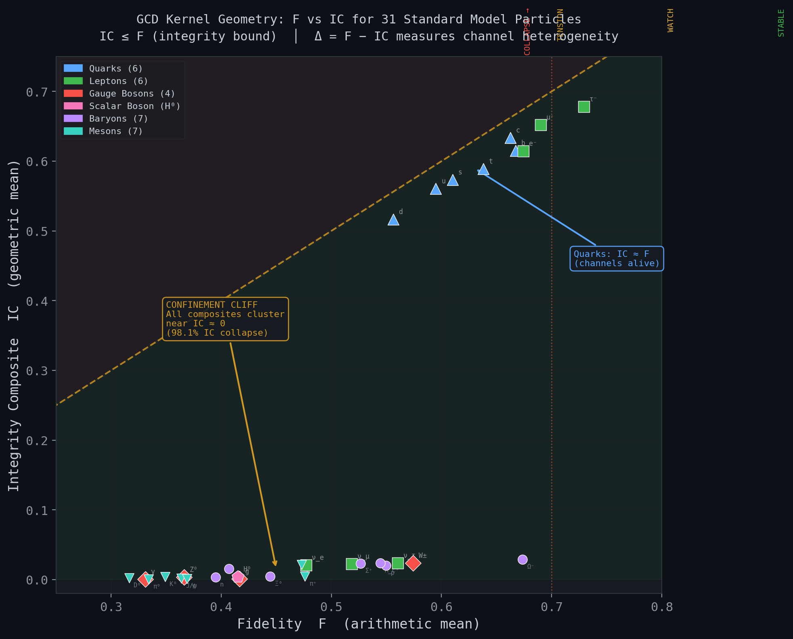
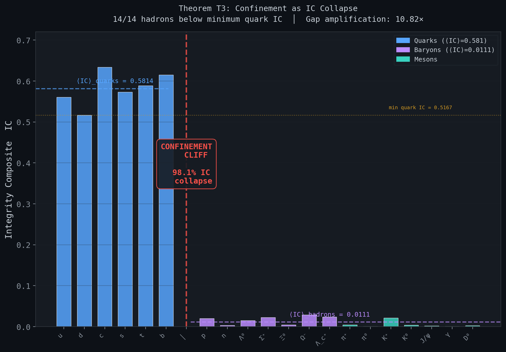
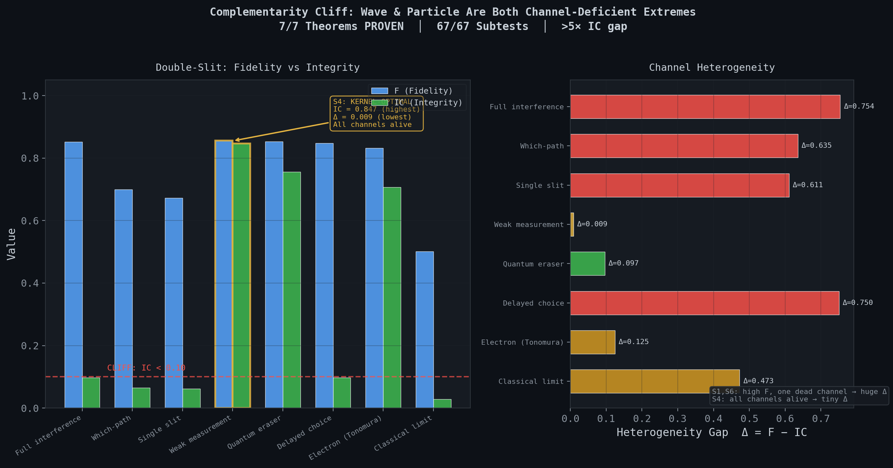
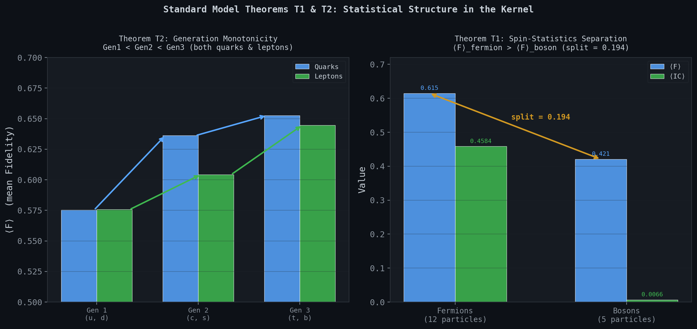
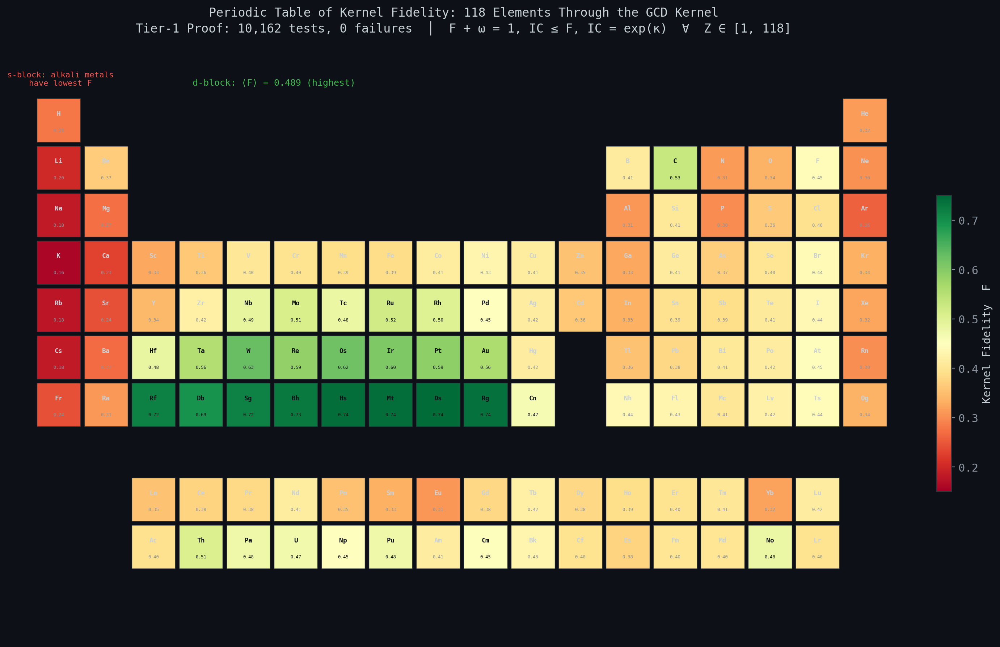
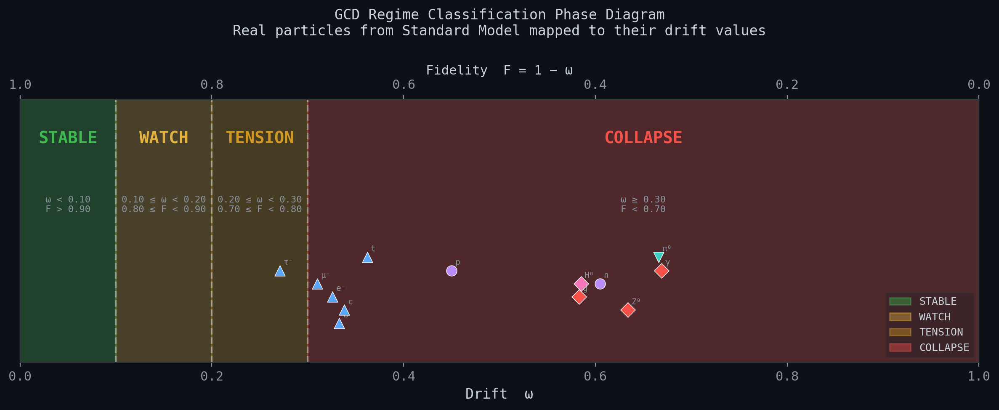

# Generative Collapse Dynamics (GCD)

[](https://github.com/calebpruett927/GENERATIVE-COLLAPSE-DYNAMICS/actions)
[](https://www.python.org/downloads/)
[](src/umcp_cpp/)
[](LICENSE)
[](pyproject.toml)
[](tests/)
[](closures/)
[](closures/)
[](closures/)
[](scripts/)

> **Core Axiom**: *"Collapse is generative; only what returns is real."*

**Universal Measurement Contract Protocol (UMCP)** is a contract-first validation framework that verifies reproducible computational workflows against mathematical contracts. It implements **Generative Collapse Dynamics (GCD)** and **Recursive Collapse Field Theory (RCFT)** — a unified measurement theory where every claim must demonstrate return through collapse under frozen evaluation rules.

This is not a simulation. It is a **metrological enforcement engine**: schema conformance, kernel identity verification, regime classification, and SHA-256 integrity checking — producing a three-valued `CONFORMANT` / `NONCONFORMANT` / `NON_EVALUABLE` verdict for every run.

**Python + C++ integration**: The framework is written in Python with **20 domains**, **174 closure modules**, **241 proven theorems**, and **8,397 tests**. An optional C++17 accelerator (`src/umcp_cpp/`) provides 50–80× speedup for three hot paths — kernel computation, seam chain accumulation, and SHA-256 integrity — via a pybind11 zero-copy NumPy bridge. The Python wrapper (`umcp.accel`) auto-detects the compiled extension at import time; if unavailable, every call falls back transparently to the equivalent NumPy implementation. Same formulas, same frozen parameters, same results to machine precision — the C++ layer is Tier-0 Protocol only and redefines no Tier-1 symbols.

---

## Table of Contents

<!-- nav: HTML anchors used to avoid false-positive "file not found" diagnostics -->
<ul>
<li><a href="#core-concepts">Core Concepts</a></li>
<li><a href="#at-a-glance">At a Glance</a>
  <ul>
  <li><a href="#the-spine--every-claim-in-five-stops">The Spine</a></li>
  <li><a href="#the-three-tier-stack">The Three-Tier Stack</a></li>
  </ul>
</li>
<li><a href="#interactive-dashboard">Interactive Dashboard</a></li>
<li><a href="#architecture">Architecture</a></li>
<li><a href="#closure-domains">Closure Domains (20 Domains)</a></li>
<li><a href="#the-kernel">The Kernel</a></li>
<li><a href="#originality--terminology">Originality &amp; Terminology</a></li>
<li><a href="#installation">Installation</a></li>
<li><a href="#quick-start">Quick Start</a></li>
<li><a href="#cli-reference">CLI Reference</a>
  <ul>
  <li><a href="#startup--from-clone-to-running">Startup — From Clone to Running</a></li>
  <li><a href="#c-accelerator--build--verify">C++ Accelerator — Build &amp; Verify</a></li>
  <li><a href="#services--api--dashboard">Services — API &amp; Dashboard</a></li>
  <li><a href="#development-loop--edit-validate-commit">Development Loop — Edit, Validate, Commit</a></li>
  <li><a href="#reset--clean-slate">Reset &amp; Clean Slate</a></li>
  <li><a href="#useful-utilities">Useful Utilities</a></li>
  </ul>
</li>
<li><a href="#validation-pipeline">Validation Pipeline</a></li>
<li><a href="#test-suite">Test Suite</a></li>
<li><a href="#documentation">Documentation</a></li>
<li><a href="#diagrams--proofs">Diagrams &amp; Proofs</a></li>
<li><a href="#key-discoveries">Key Discoveries</a>
  <ul>
  <li><a href="#the-44-structural-identities">The 44 Structural Identities</a></li>
  <li><a href="#recent-closure-syntheses">Recent Closure Syntheses</a></li>
  </ul>
</li>
<li><a href="#papers--publications">Papers &amp; Publications</a></li>
<li><a href="#repository-structure">Repository Structure</a></li>
<li><a href="#contributing">Contributing</a></li>
<li><a href="#license">License</a></li>
</ul>

---

## Core Concepts

### Collapse Is Generative; Only What Returns Is Real

UMCP enforces a single axiom (**Axiom-0**): *"Collapse is generative; only what returns is real."* This is not a metaphor — it is a constraint on admissible claims. If you claim a system is stable, continuous, or coherent, you must show it can re-enter its admissible neighborhood after drift, perturbation, or delay — under the same frozen evaluation rules. Every claim passes through **the spine**: Contract → Canon → Closures → Integrity Ledger → Stance.

| Term | Operational Meaning |
|------|---------------------|
| **Collapse** | Regime label produced by kernel gates on (ω, F, S, C) under frozen thresholds |
| **Return** (τ_R) | Re-entry condition: existence of prior state within tolerance; yields τ_R or INF_REC |
| **Gesture** | An epistemic emission that does not weld: no return, no credit |
| **Drift** (ω) | ω = 1 − F, collapse proximity measure, range [0, 1] |
| **Integrity** (IC) | Kernel composite: IC = exp(κ), geometric mean of channel contributions |
| **Seam** | The verification boundary between outbound collapse and demonstrated return |
| **Frozen** | Consistent across the seam — same rules govern both sides of every collapse-return boundary |
| **Contract** | Frozen interface snapshot: pins units, embedding, clipping, weights, return settings |

### Three-Valued Verdicts

Every validation produces one of three outcomes — never boolean:

- **`CONFORMANT`** — All contracts, identities, and integrity checks pass
- **`NONCONFORMANT`** — At least one check fails
- **`NON_EVALUABLE`** — Insufficient data to determine status

---

## At a Glance

### The Spine — Every Claim in Five Stops

> *Spina non negotiabilis est.* — The spine is non-negotiable.

Every claim, measurement, validation, and narrative in UMCP follows exactly **five stops**, in order:

```
┌─────────────┐    ┌─────────────┐    ┌──────────────┐    ┌───────────────────┐    ┌──────────┐
│   CONTRACT  │───▶│    CANON    │───▶│   CLOSURES   │───▶│ INTEGRITY LEDGER  │───▶│  STANCE  │
│   (freeze)  │    │   (tell)    │    │  (publish)   │    │   (reconcile)     │    │  (read)  │
└─────────────┘    └─────────────┘    └──────────────┘    └───────────────────┘    └──────────┘
   Define             Narrate           Threshold           Debit/Credit           Verdict
   before             with 5            gates; no           must balance;          derived,
   evidence           words             mid-episode          residual ≤ tol        never
                                        edits                                      asserted
```

| Stop | What Happens | Key Question |
|------|-------------|--------------|
| **Contract** | Freeze sources, normalization, thresholds, return domain — before any evidence | *What are the rules?* |
| **Canon** | Tell the story using five words: **Drift · Fidelity · Roughness · Return · Integrity** | *What happened?* |
| **Closures** | Publish threshold gates and their evaluation order — no edits once published | *What counts?* |
| **Integrity Ledger** | Debit Drift (D_ω) + Roughness (D_C), credit Return (R·τ_R); residual must close (≤ tol_seam) | *Does the account balance?* |
| **Stance** | Read the verdict from gates: **Stable / Watch / Collapse** (+Critical overlay if IC < 0.30) | *What's the verdict?* |

**Two governance mechanisms** punctuate the spine:
- **Manifest** — provenance binding (time, tools, checksums). Every claim carries its receipt.
- **Weld** — continuity across change. The only legitimate way to change policy. History is append-only and welded, never rewritten.

### The Three-Tier Stack

Tier-1 (44 structural identities, 46 lemmas, 241 proven theorems) → Tier-0 (8,397 tests, 174 closure modules, C++17 accelerator) → Tier-2 (20 domains from particle physics to consciousness). One-way dependency. No back-edges within a frozen run.



### Integrity Bound: IC ≤ F — Zero Violations Across 6 Domains

The integrity bound holds universally from quarks to consciousness — verified across Standard Model particles, 118 periodic table elements, 40 organisms, 30 sign systems, and 20 consciousness states. Derived independently from Axiom-0. Zero violations across all domains.



### Validation Timelapse: Living Ledger History

Every `umcp validate` run is recorded in the append-only ledger. Cumulative runs, kernel invariant evolution, and conformance rate over time. *"Nihil in memoria perit."*



---

## Interactive Dashboard

**46 pages · 20 science domains · Real-time kernel exploration**

UMCP ships with a full-featured **Streamlit dashboard** for interactive exploration of every domain, kernel metric, and validation result. No coding required — launch it with one command and explore everything from subatomic particles to neuroscience through the GCD kernel.

### Quick Launch

```bash
# Install with visualization dependencies
pip install -e ".[all]"

# Launch the dashboard (opens at http://localhost:8501)
umcp-dashboard
```

That's it. The dashboard auto-detects all casepacks, contracts, closures, and ledger data.

### What's Inside

| Category | Pages | Highlights |
|----------|-------|------------|
| **Core** | Overview, Domain Overview, Health, Ledger, Metrics | System-wide health monitoring, conformance tracking, kernel metric trends |
| **Science Domains** | Cosmology, Astronomy, Nuclear, Quantum, Atomic Physics, Standard Model, Materials Science, Finance, RCFT, Security, Everyday Physics, Dynamic Semiotics | Interactive closure exploration for all 20 domains with live kernel computation |
| **Evolution & Cognition** | Evolution Kernel, Brain Kernel, Awareness Manifold, Cognitive Traversal | 40-organism evolution kernel, 10-channel brain analysis, compositional traversal |
| **Analysis** | Regime, Time Series, Comparison, Formula Builder, Precision | Regime phase diagrams, cross-domain comparison, custom formula evaluation |
| **Exploration** | Canon Explorer, Geometry, Rosetta Translation (9 lenses), Orientation, Physics, Kinematics | Cross-domain Rosetta translation (incl. Semiotics lens), three-layer geometry visualization |
| **Tools** | Casepacks, Contracts, Closures, Live Runner, Batch Validation, Test Templates | Run validations directly from the browser, inspect casepack structure |
| **Diagnostics** | τ_R* Diagnostic, Epistemic Classification, Insights Engine | Thermodynamic phase diagrams, epistemic cost tracking, pattern discovery |
| **Manage** | Exports, Bookmarks, Notifications, API Integration | Export results, bookmark pages, connect to the REST API |

### Features

- **Categorized sidebar navigation** with expandable sections and quick-action buttons
- **Live validation** — run `umcp validate` on any casepack directly from the browser
- **Regime visualization** — interactive phase space plots with Stable / Watch / Collapse classification
- **Kernel computation** — compute F, ω, S, C, κ, IC on custom trace vectors in real time
- **Cross-domain comparison** — compare kernel outputs across all 20 domains
- **Auto-refresh mode** — continuously monitor validation status
- **Responsive layout** with compact mode for data-dense views

### Alternative Launch Methods

```bash
# Direct Streamlit invocation (headless mode for servers)
streamlit run src/umcp/dashboard/__init__.py --server.port 8501 --server.headless true

# Via helper scripts
bash scripts/start_dashboard.sh            # Start in background
bash scripts/stop_dashboard.sh             # Stop background instance
```

### REST API (Companion)

The dashboard pairs with an optional FastAPI REST server for programmatic access:

```bash
umcp-api                                   # Starts at http://localhost:8000
# Interactive docs at http://localhost:8000/docs
```

---

## Architecture

### The Unit of Work: Casepacks

A **casepack** is the atomic unit of reproducible validation — a self-contained directory with:

```
casepacks/my_experiment/
├── manifest.json          # Contract reference, closure list, expected outputs
├── raw_data/              # Input observables
├── closures/              # Domain-specific computation modules
└── expected/              # Expected outputs for verification
```

UMCP ships with **24 casepacks** spanning all 20 domains.

### Core Engine

```
src/umcp/
├── cli.py                    # Validation engine & all subcommands
├── validator.py              # Root-file validator (16 files, checksums, math identities)
├── kernel_optimized.py       # Lemma-based kernel computation (F, ω, S, C, κ, IC)
├── seam_optimized.py         # Optimized seam budget computation (Γ, D_C, Δκ)
├── tau_r_star.py             # τ_R* thermodynamic diagnostic (phase diagram)
├── tau_r_star_dynamics.py    # Dynamic τ_R* evolution and trajectories
├── compute_utils.py          # Vectorized utilities (coordinate clipping, bounds)
├── epistemic_weld.py         # Epistemic cost tracking (Theorem T9: observation cost)
├── measurement_engine.py     # Measurement pipeline engine
├── frozen_contract.py        # Frozen contract constants dataclass
├── insights.py               # Lessons-learned database (pattern discovery)
├── uncertainty.py            # Uncertainty propagation and error analysis
├── ss1m_triad.py             # SS1M triad computation
├── universal_calculator.py   # Universal kernel calculator CLI
├── fleet/                    # Distributed fleet-scale validation
│   ├── scheduler.py          # Job scheduler (submit, route, track)
│   ├── worker.py             # Worker + WorkerPool (register, heartbeat, execute)
│   ├── queue.py              # Priority queue (DLQ, retry, backpressure)
│   ├── cache.py              # Content-addressable artifact cache
│   └── tenant.py             # Multi-tenant isolation, quotas, namespaces
├── accel.py                  # C++ accelerator wrapper (auto-fallback to NumPy)
├── dashboard/                # Modular Streamlit dashboard
└── api_umcp.py               # FastAPI REST extension (Pydantic models)

src/umcp_cpp/                   # Optional C++ accelerator (Tier-0 Protocol)
├── include/umcp/
│   ├── kernel.hpp            # Kernel computation (F, ω, S, C, κ, IC) — ~50× speedup
│   ├── seam.hpp              # Seam chain accumulation — ~80× speedup
│   └── integrity.hpp         # SHA-256 (portable + OpenSSL) — ~5× speedup
├── bindings/py_umcp.cpp      # pybind11 zero-copy NumPy bridge
├── tests/test_kernel.cpp     # Catch2 tests (10K Tier-1 sweep)
└── CMakeLists.txt            # C++17, pybind11, optional OpenSSL
```

### Contract Infrastructure

| Artifact | Count | Location | Purpose |
|----------|:-----:|----------|---------|
| **Contracts** | 21 | `contracts/*.yaml` | Frozen mathematical contracts (JSON Schema Draft 2020-12) |
| **Schemas** | 17 | `schemas/*.schema.json` | JSON Schema files validating all artifacts |
| **Canon Anchors** | 21 | `canon/*.yaml` | Domain-specific canonical reference points |
| **Casepacks** | 24 | `casepacks/` | Reproducible validation bundles |
| **Closure Domains** | 20 | `closures/*/` | Domain closure packages (174 modules) |
| **Closure Registry** | 1 | `closures/registry.yaml` | Central listing of all closures |
| **Validator Rules** | 1 | `validator_rules.yaml` | Semantic rule definitions (E101, W201, ...) |
| **Integrity** | 1 | `integrity/sha256.txt` | SHA-256 checksums for 194 tracked files |

---

## Closure Domains

UMCP validates across **20 domains** with **174 closure modules**, each encoding real-world measurements into the 8-channel kernel trace:

### Standard Model — 12 modules

The crown jewel: 31 particles mapped through the GCD kernel with **27 proven theorems** (134/134 subtests at machine precision). Part of a **247-theorem corpus** across 20 formalisms spanning particle physics, quantum mechanics, nuclear physics, materials science, evolution, consciousness, semiotics, awareness-cognition, active matter, and blast-wave dynamics.

| Module | What It Encodes |
|--------|----------------|
| `particle_catalog.py` | Full SM particle table (PDG 2024 data) |
| `subatomic_kernel.py` | 31 particles → 8-channel trace → kernel |
| `particle_physics_formalism.py` | 10 Tier-2 theorems connecting SM physics to GCD |
| `coupling_constants.py` | Running couplings α_s(Q²), α_em(Q²), G_F |
| `cross_sections.py` | σ(e⁺e⁻→hadrons), R-ratio, Drell-Yan |
| `symmetry_breaking.py` | Higgs mechanism, VEV = 246.22 GeV, Yukawa |
| `ckm_mixing.py` | CKM matrix, Wolfenstein parametrization, J_CP |
| `neutrino_oscillation.py` | Neutrino oscillation and mass mixing |
| `pmns_mixing.py` | PMNS matrix, leptonic mixing angles |
| `matter_genesis.py` | 7 acts of matter: 99 entities, 10 genesis theorems (T-MG-1–T-MG-10), 5 phase boundaries |
| `particle_matter_map.py` | 6-scale cross-scale kernel, 8 matter ladder theorems (T-PM-1–T-PM-8) |
| `sm_extended_theorems.py` | 15 extended theorems (T13–T27): PMNS, CKM, Yukawa, coupling RGE, cross sections, matter map |

**Key discoveries**: Confinement visible as a 98.1% IC cliff at the quark→hadron boundary. Neutral particles show 50× IC suppression. Generation monotonicity (Gen1 < Gen2 < Gen3) confirmed in both quarks and leptons.

### Atomic Physics — 10 modules

118 elements through the periodic kernel with **exhaustive Tier-1 proof** (10,162 tests, 0 failures).

| Module | What It Encodes |
|--------|----------------|
| `periodic_kernel.py` | 118-element periodic table through GCD kernel |
| `cross_scale_kernel.py` | 12-channel nuclear-informed atomic analysis |
| `tier1_proof.py` | Exhaustive proof: F+ω=1, IC≤F, IC=exp(κ) for all 118 elements |
| `electron_config.py` | Shell filling and configuration analysis |
| `fine_structure.py` | Fine structure constant α = 1/137 |
| `ionization_energy.py` | Ionization energy closures for all elements |
| `spectral_lines.py` | Emission/absorption spectral analysis |
| `selection_rules.py` | Quantum selection rules (Δl = ±1) |
| `zeeman_stark.py` | Zeeman and Stark effects |
| `recursive_instantiation.py` | Recursive instantiation patterns |

### Quantum Mechanics — 12 modules

| Module | What It Encodes |
|--------|----------------|
| `double_slit_interference.py` | 8 scenarios, 7 theorems (T-DSE-1–T-DSE-7) — complementarity cliff discovery |
| `atom_dot_mi_transition.py` | Atom→quantum dot transition, 7 theorems (T-ADOT-1–T-ADOT-7, 120 tests) |
| `ters_near_field.py` | TERS near-field enhancement, 7 theorems (T-TERS-1–T-TERS-7, 72 tests) |
| `muon_laser_decay.py` | Muon-laser decay scenarios, 7 theorems (T-MLD-1–T-MLD-7, 243 tests) |
| `quantum_dimer_model.py` | Yan et al. 2022 QDM, 7 theorems (T-QDM-1–T-QDM-7, 315 tests) |
| `fqhe_bilayer_graphene.py` | Kim et al. 2026 FQHE bilayer graphene, 7 theorems (T-FQHE-1–T-FQHE-7, 349 tests) |
| `wavefunction_collapse.py` | Wavefunction collapse dynamics |
| `entanglement.py` | Entanglement correlations |
| `tunneling.py` | Quantum tunneling barriers |
| `harmonic_oscillator.py` | Quantum harmonic oscillator |
| `uncertainty_principle.py` | Heisenberg uncertainty |
| `spin_measurement.py` | Spin measurement outcomes |

**Key discovery (double slit)**: Wave and particle are *both channel-deficient extremes*. The kernel-optimal state is partial measurement (V=0.70, D=0.71) where all channels are alive — the **complementarity cliff** (>5× IC gap).

### Materials Science — 15 modules

| Module | What It Encodes |
|--------|----------------|
| `element_database.py` | 118 elements × 18 fields |
| `band_structure.py` | Electronic band structure |
| `bcs_superconductivity.py` | BCS superconductivity theory |
| `cohesive_energy.py` | Cohesive energy analysis |
| `debye_thermal.py` | Debye thermal model |
| `elastic_moduli.py` | Elastic moduli computation |
| `magnetic_properties.py` | Magnetic property analysis |
| `opoly26_polymer_dataset.py` | OPoly26 polymer ML dataset (800+ data points, 5 models, 9 tables) |
| `phase_transition.py` | Phase transition dynamics |
| `surface_catalysis.py` | Surface catalysis reactions |
| `gap_capture_ss1m.py` | SS1M gap capture |
| `bioactive_compounds_database.py` | Bioactive compounds database (181 tests) |
| `crystal_morphology_database.py` | Crystal and particle detector morphology (88 tests) |
| `particle_detector_database.py` | Particle detector materials database |
| `photonic_materials_database.py` | Photonic materials database (200 tests) |

### Nuclear Physics — 10 modules

Alpha decay, fission, shell structure, decay chains, Bethe-Weizsäcker binding energy, **QGP/RHIC closure** (27 entities, 10 theorems T-QGP-1–T-QGP-10, 266 tests — quark-gluon plasma phase structure from RHIC/STAR/PHENIX data), and **Trinity blast wave closure** (29 entities, 16 theorems T-TB-1–T-TB-16, 433 tests — Taylor-Sedov self-similar expansion).

### RCFT (Recursive Collapse Field Theory) — 10 modules

Attractor basins, fractal dimension, collapse grammar, information geometry, universality class assignment, active matter dynamics, RCFT field diagnostics, and **Quincke rollers** (12 experimental states, 8 theorems T-QR-1–T-QR-8, 185 tests — magnetic active matter from Garza et al. 2023).

### Astronomy — 8 modules

Stellar evolution, HR diagram classification, distance ladder, gravitational dynamics, orbital mechanics, spectral analysis, stellar luminosity, and **stellar ages cosmology** (Tomasetti et al. 2026 — oldest MW stars, H₀ tension, 159 tests).

### Kinematics — 6 modules

Linear and rotational kinematics, energy mechanics, momentum dynamics, phase space return, and kinematic stability.

### Weyl Cosmology — 6 modules

Modified gravity, Limber integrals, boost factors, sigma evolution, cosmology background, and Weyl transfer functions.

### GCD (Generative Collapse Dynamics) — 7 modules

Energy potential, entropic collapse, field resonance, generative flux, momentum flux, universal regime calibration (12 scenarios, 7 theorems, 94 subtests), and **kernel structural theorems** (7 theorems, 73 subtests): dimensionality fragility, positional democracy, weight hierarchy, monitoring paradox, approximation boundary, U-curve of degradation, and p=3 unification.

### Finance & Security — 16 modules

Portfolio continuity, market coherence, anomaly return, threat classification, trust fidelity, behavioral profiling, privacy auditing, and risk-regime mapping.

### Evolution — 6 modules

40 organisms across the tree of life, 5 recursive scales, 20 evolutionary phenomena as collapse-return cycles, deep implications with 20 cited sources (Fisher 1930 – Barnosky 2011), and a **10-channel brain kernel** spanning 20 species from C. elegans to Homo sapiens.

| Module | What It Encodes |
|--------|----------------|
| `evolution_kernel.py` | 40 organisms × 8 channels (genetic diversity → lineage persistence) |
| `recursive_evolution.py` | 5 nested scales (Gene → Clade) + 5 mass extinction collapse-return events |
| `axiom0_instantiation_map.py` | 20 phenomena × 3 states = 60 kernel states — Axiom-0 instantiation |
| `deep_implications.py` | 8 identity mappings, 8 deep case studies, 5 testable predictions, Fisher Information connection |
| `brain_kernel.py` | 20 species × 10 neuroscience channels, developmental trajectory (8 stages), 8 pathologies |
| `homo_sapiens_analysis.py` | Homo sapiens deep kernel portrait, 5 awareness patterns, cultural persistence sweep |

**Key discoveries**: Evolution is the only domain at 12/12 semantic depth (every Axiom-0 concept maps precisely). IC degrades Gene (0.694) → Clade (0.469) across recursive scales. End-Permian IC dropped 80.1% then recovered generatively. Geometric slaughter = mechanism of extinction: one failed channel kills IC regardless of mean fitness. Heterogeneity gap Δ ≈ Var(c)/(2c̄) maps precisely to Fisher Information of the channel pattern. 15/20 phenomena are generative (IC_return > IC_pre). Cancer is the anti-proof: cells maximizing individual F while destroying organism IC. Homo sapiens Δ ≈ 0.34 — structurally the most vulnerable extant large mammal. Zero fitted parameters — same frozen contract as Standard Model and atomic closures.

**Brain kernel discoveries**: The brain-organism paradox — the most coherent brain (IC/F = 0.996, Δ = 0.004) lives inside the most fragile organism (IC/F = 0.487, Δ = 0.336). Language is the universal bottleneck: 17/19 non-human species have `language_architecture` as weakest channel. Consciousness is a software phenomenon (Software substrate gap 0.967 vs 0.433 human vs chimp) running on adequate hardware. Neanderthal extinction was a language gap: `language_architecture` = 0.40 vs sapiens 0.98. Human brain development is a regime journey: Newborn (Collapse, IC/F = 0.669) → Adolescent (peak, IC/F = 0.992) → Elderly (Collapse, IC/F = 0.883).

### Everyday Physics — 5 modules

Thermodynamics, optics, electromagnetism, wave phenomena, and epistemic coherence. Demonstrates that the same minimal structure (F + ω = 1, IC ≤ F, IC = exp(κ)) governs macroscopic phenomena.

### Dynamic Semiotics — 1 module

30 sign systems mapped through an 8-channel semiotic kernel spanning symbolic recursion, interpretive depth, temporal persistence, channel count, noise immunity, generative capacity, compositionality, and contextual adaptability.

| Module | What It Encodes |
|--------|----------------|
| `semiotic_kernel.py` | 30 sign systems × 8 channels — from DNA codons to natural languages |

**Key discoveries**: Natural languages (English, Mandarin) achieve highest IC (≈0.60) through balanced channels — no single channel dominates. Formal systems (Mathematical Notation, Formal Logic) show the largest heterogeneity gap Δ due to geometric slaughter from low noise immunity channels. Traffic signals are "Fixed Signal" systems (high noise immunity but no symbolic recursion). Dead writing systems (Egyptian Hieroglyphs, Sumerian Cuneiform) are correctly classified as "Gestus Dead System" (τ_R = ∞_rec). The brain kernel bridge maps 8 semiotic channels onto 10 neuroscience channels, revealing that language_architecture is the universal bottleneck across species.

**Semiotic convergence discovery** (see [SEMIOTIC_CONVERGENCE.md](SEMIOTIC_CONVERGENCE.md)): GCD does not *use* semiotics — GCD *is* a semiotic system. The Peirce sign triad (Object–Sign–Interpretant) maps exactly to the GCD pipeline (x(t)–Ψ(t)–kernel invariants). The seam is the formal mechanism that completes Peirce's unlimited semiosis by distinguishing signs that *return* from signs that are merely *gestures*. Channel-IC correlation analysis reveals that meaning is **density × depth** (semiotic_density r = +0.886 with IC), not stability × resemblance (iconic_persistence r ≈ 0). GCD's own tools — kernel equations, Latin lexicon, discourse spine, Python codebase — all share `iconic_persistence` as their weakest channel, confirming the system's root trade-off: abstraction over iconicity.

### Consciousness Coherence — 2 modules

20 consciousness systems mapped through a coherence kernel with **7 proven theorems** (T-CC-1 through T-CC-7). Includes Butzbach embedding for cross-scale consciousness analysis.

| Module | What It Encodes |
|--------|----------------|
| `coherence_kernel.py` | 20 consciousness systems × 8 channels |
| `consciousness_theorems.py` | 7 theorems: coherence bounds, regime classification, cross-domain bridges |

### Awareness Cognition — 2 modules

34 organisms across phylogeny mapped through a **5+5 awareness-aptitude kernel** (5 awareness channels + 5 aptitude channels) with **10 proven theorems** (T-AW-1 through T-AW-10).

| Module | What It Encodes |
|--------|----------------|
| `awareness_kernel.py` | 34 organisms × 10 channels (5 awareness + 5 aptitude) |
| `awareness_theorems.py` | 10 theorems: inversion, instability, slaughter bottleneck, sensitivity, cross-domain isomorphism |

**Key discoveries**: Awareness and aptitude anti-correlate across phylogeny (T-AW-1). Zero organisms reach Stable regime — universal instability (T-AW-2). Aptitude channels control IC for aware organisms via geometric slaughter (T-AW-3). Same kernel signature as SM confinement T3 — cross-domain isomorphism (T-AW-5). Human development trajectory: F peaks at adult, declines in elderly (T-AW-7).

### Continuity Theory — 1 module

| Module | What It Encodes |
|--------|----------------|
| `butzbach_embedding.py` | Continuity law closures and Butzbach embedding |

---

## The Kernel

At the mathematical core of GCD is the **kernel** — a function mapping any set of measurable channels to a fixed set of invariants. Its geometry is the **Bernoulli manifold**: a flat Riemannian manifold in Fisher coordinates where every channel value c maps to an angle θ = arcsin(√c).

### Trace Vector

Every observable maps to an 8-channel trace vector **c** with weights **w**:

$$F = \sum_i w_i c_i \quad \text{(Fidelity — arithmetic mean)}$$

$$\text{IC} = \exp\!\left(\sum_i w_i \ln c_{i,\varepsilon}\right) \quad \text{(Integrity Composite — geometric mean)}$$

$$\omega = 1 - F \quad \text{(Drift)}$$

$$\Delta = F - \text{IC} \quad \text{(heterogeneity gap — channel heterogeneity)}$$

### Tier-1 Identities (proven for every input)

These hold universally by construction:

| Identity | Meaning | Geometric Interpretation |
|----------|---------|--------------------------|
| F + ω = 1 | Fidelity and drift are complementary | Pythagorean theorem in Fisher coordinates: sin²θ + cos²θ = 1 |
| IC ≤ F | Integrity bound: coherence never exceeds fidelity | Solvability condition: c₁,₂ = F ± √(F² − IC²) requires IC ≤ F |
| IC = exp(κ) | Integrity equals exponentiated log-mean | Log-integrity is κ = w·ln(sin²θ) in Fisher coordinates |

### The One-Formula Principle

Entropy S and log-integrity κ are not separate quantities. They are both projections of a single function:

$$f(\theta) = 2\cos^2\theta \cdot \ln(\tan\theta)$$

This gives S(c) + κ(c) exactly (verified to < 10⁻¹⁶). It peaks at c\* ≈ 0.7822 (the logistic self-dual fixed point), giving S + κ = ln 2 − 1/2. It vanishes at the equator c = 1/2.

### Five Structural Constants

Five distinguished points partition the Bernoulli manifold. None are chosen — all emerge from the kernel equations:

| Constant | Value | Role |
|----------|-------|------|
| **ε** | 10⁻⁸ | Guard band — no channel fully dies |
| **c_trap** | 0.3177 | Trapping threshold — Γ(ω_trap) = 1 exactly, Cardano root of x³+x=1 |
| **1/2** | 0.5000 | Equator — maximum entropy, S + κ = 0 |
| **c\*** | 0.7822 | Self-dual point — maximizes S + κ per channel |
| **1 − ε** | ≈ 1 | Perfect fidelity boundary |

### Regime Classification

| Regime | Condition | Fisher Space % | Interpretation |
|--------|-----------|:--------------:|----------------|
| **STABLE** | ω < 0.038 ∧ F > 0.90 ∧ S < 0.15 ∧ C < 0.14 | 12.5% | System within nominal bounds |
| **WATCH** | 0.038 ≤ ω < 0.30 (or Stable gates not all met) | 24.4% | Elevated drift, monitoring required |
| **COLLAPSE** | ω ≥ 0.30 | 63.1% | Past viable return credit |
| **CRITICAL** | IC < 0.30 (severity overlay, any regime) | — | Integrity dangerously low |

**Stability is rare** — 87.5% of the manifold lies outside it. Return from collapse to stability is what the axiom measures.

### The Heterogeneity Gap (Δ)

The gap Δ = F − IC is the central diagnostic. It measures **channel heterogeneity**:

- **Δ ≈ 0**: All channels contribute equally — homogeneous system
- **Δ large**: One or more channels at guard band (ε = 10⁻⁸) — information is being destroyed in specific channels
- **Universal pattern**: κ < −2 ↔ IC < 0.15 — the collapse floor

### Composition Laws

When independent subsystems are composed:
- **F composes arithmetically**: F₁₂ = (F₁ + F₂)/2
- **IC composes geometrically**: IC₁₂ = √(IC₁ · IC₂)
- **Δ is a composition invariant** for identical subsystems

This means IC is strictly more sensitive to heterogeneity than F — one weak subsystem drags IC down geometrically while F stays healthy arithmetically.

---

## Originality & Terminology

This system is **original**. Classical results emerge as **degenerate limits** when degrees of freedom are removed from the GCD kernel. The arrow of derivation runs **from the axiom to the classical result**, never the reverse.

| GCD Structure | Classical Degenerate Limit |
|---------------|---------------------------|
| **Integrity bound** (IC ≤ F) | AM-GM inequality (strip channel semantics, weights, guard band) |
| **Bernoulli field entropy** S | Shannon entropy (restrict collapse field to {0,1}) |
| **Duality identity** F + ω = 1 | Unitarity (strip thermodynamic cost function) |
| **Duality identity** F + ω = 1 | Fluctuation-dissipation theorem (restrict to linear response near equilibrium) |
| **Log-integrity relation** IC = exp(κ) | Exponential map (strip kernel architecture) |
| **Heterogeneity gap** Δ = F − IC | heterogeneity gap (strip channel semantics) |
| **Frozen parameters** (ε, p, tol_seam) | Constants / hyperparameters (strip seam derivation) |

**Key vocabulary**: Say "integrity bound," not "AM-GM inequality." Say "Bernoulli field entropy," not "Shannon entropy." Say "derives independently," not "rederives" or "recovers." Say "frozen," not "constant" or "hyperparameter." See `AXIOM.md`, `.github/copilot-instructions.md`, and `CATALOGUE.md` for the complete terminology reference. The catalogue provides the definitive lookup: every symbol, lemma, identity, and theorem has a unique tag with its full definition, tier, and derivation lineage.

---

## Installation

### Core (validation only)

```bash
pip install -e .
```

### Development (full suite)

```bash
pip install -e ".[all]"
```

### Dependencies

| Category | Packages |
|----------|----------|
| **Core** | `pyyaml`, `jsonschema`, `numpy`, `scipy` |
| **Dev** | `pytest`, `ruff`, `mypy`, `pre-commit` |
| **API** | `fastapi`, `uvicorn` (optional) |
| **Viz** | `streamlit`, `plotly`, `pandas` (optional) |
| **C++ Accel** | `pybind11`, CMake ≥ 3.16, C++17 compiler (optional) |

**Requires**: Python ≥ 3.11

### C++ Accelerator (Optional)

The C++ accelerator provides 50–80× speedup for kernel computation, seam chains,
and SHA-256 integrity checks. It is **fully optional** — all functionality falls
back to NumPy transparently.

```bash
# Build the accelerator
cd src/umcp_cpp && mkdir build && cd build
cmake .. && make -j$(nproc)

# Verify it works
python -c "from umcp.accel import backend; print(backend())"  # 'cpp' or 'numpy'

# Run benchmarks (works with either backend)
python scripts/benchmark_cpp.py
```

**Architecture**: `accel.py` auto-detects whether the C++ extension is available.
No existing code changes are needed — import from `umcp.accel` instead of
calling kernel functions directly for accelerated paths.

```python
from umcp.accel import compute_kernel, compute_kernel_batch, SeamChain, hash_file

# Identical API regardless of backend
result = compute_kernel(channels, weights)
batch  = compute_kernel_batch(trace_matrix, weights)  # 10K rows in ms
```

---

## Quick Start

### Validate the entire repository

```bash
umcp validate .
```

### Validate a specific casepack

```bash
umcp validate casepacks/hello_world
umcp validate casepacks/hello_world --strict
```

### Run the test suite

```bash
pytest                            # All 8,397 tests
pytest -v --tb=short            # Verbose with short tracebacks
pytest -n auto                  # Parallel execution
```

### Check integrity

```bash
umcp integrity                  # Verify SHA-256 checksums
```

### Launch the dashboard

```bash
umcp-dashboard                             # Start interactive dashboard on :8501
```

See the <strong><a href="#interactive-dashboard">Interactive Dashboard</a></strong> section above for full details, features, and all 46 pages.

### Use the kernel in Python

```python
from umcp.kernel_optimized import compute_kernel_outputs

channels = [0.9, 0.8, 0.7, 0.6, 0.5, 0.4, 0.3, 0.2]
weights = [0.125] * 8  # Equal weights

result = compute_kernel_outputs(channels, weights)
print(f"F={result.F:.4f}, ω={result.omega:.4f}, IC={result.IC:.6f}")
print(f"Regime: {result.regime}")
print(f"Heterogeneity gap: {result.heterogeneity_gap:.6f}")  # Δ = F − IC
```

---

## CLI Reference

| Command | Description |
|---------|-------------|
| `umcp validate .` | Validate entire repository |
| `umcp validate <path> --strict` | Strict validation (warnings → failures) |
| `umcp validate <path> --out report.json` | Output JSON report |
| `umcp integrity` | Verify SHA-256 checksums |
| `umcp list casepacks` | List available casepacks |
| `umcp health` | Health check |
| `umcp-calc` | Universal kernel calculator |
| `umcp-ext list` | List available extensions |
| `umcp-api` | Start FastAPI server (:8000) |
| `umcp-dashboard` | Start Streamlit dashboard (:8501) |

### Startup — From Clone to Running

```bash
# 1. Clone and install
git clone https://github.com/calebpruett927/GENERATIVE-COLLAPSE-DYNAMICS.git
cd GENERATIVE-COLLAPSE-DYNAMICS
pip install -e ".[all]"                    # Core + dev + API + viz dependencies

# 2. Verify installation
umcp health                                # System health check
umcp integrity                             # Verify SHA-256 checksums
umcp validate .                            # Full repo validation → CONFORMANT

# 3. Run the test suite
pytest -v --tb=short                       # 8,397 tests
```

### C++ Accelerator — Build & Verify

```bash
# Build (requires CMake ≥ 3.16 and a C++17 compiler)
cd src/umcp_cpp && mkdir -p build && cd build
cmake .. && make -j$(nproc)
cd ../../..                                # Return to repo root

# Verify backend
python -c "from umcp.accel import backend; print(backend())"   # → 'cpp'

# Run correctness + performance benchmark (30 checks)
python scripts/benchmark_cpp.py

# Run C++ unit tests (Catch2, built alongside the extension)
cd src/umcp_cpp/build && ctest --output-on-failure && cd ../../..
```

### Services — API & Dashboard

```bash
# FastAPI REST server (http://localhost:8000)
umcp-api                                   # Or: uvicorn umcp.api_umcp:app --reload --port 8000

# Streamlit dashboard (http://localhost:8501) — see Interactive Dashboard section for details
umcp-dashboard                             # 46 pages, 20 domains, real-time kernel exploration
```

### Development Loop — Edit, Validate, Commit

```bash
# After ANY tracked file change:
python scripts/update_integrity.py         # Regenerate SHA-256 checksums (mandatory)
ruff check --fix . && ruff format .        # Auto-fix lint + formatting
pytest -v --tb=short                       # Run full test suite

# Full pre-commit protocol (mirrors CI exactly — must exit 0 before committing)
python scripts/pre_commit_protocol.py      # manifold → ruff → mypy → integrity → pytest → validate

# Dry-run (report-only, no auto-fix)
python scripts/pre_commit_protocol.py --check

# Commit only after pre-commit passes
git add -A && git commit -m "feat: description"
git push origin main
```

### Reset & Clean Slate

```bash
# Regenerate all integrity checksums from scratch
python scripts/update_integrity.py

# Re-validate the full repo (clears any stale state)
umcp validate .

# Rebuild the C++ extension from scratch
rm -rf src/umcp_cpp/build
cd src/umcp_cpp && mkdir build && cd build && cmake .. && make -j$(nproc) && cd ../../..

# Verify everything is green after a reset
python scripts/pre_commit_protocol.py      # Full protocol: lint + test + validate

# Force NumPy fallback (bypass C++ even if built)
UMCP_NO_CPP=1 python -c "from umcp.accel import backend; print(backend())"  # → 'numpy'
```

### Useful Utilities

```bash
# Kernel calculator (interactive CLI)
umcp-calc

# Finance domain CLI
umcp-finance

# List/inspect extensions
umcp-ext list
umcp-ext info api
umcp-ext check api

# Generate all diagrams from kernel data (requires: pip install matplotlib)
python scripts/generate_diagrams.py

# Periodic table report (118 elements)
python scripts/periodic_table_report.py

# Profile the test landscape
python scripts/profile_test_landscape.py

# Build LaTeX papers (requires: texlive + revtex4-2)
cd paper && pdflatex standard_model_kernel.tex && bibtex standard_model_kernel \
  && pdflatex standard_model_kernel.tex && pdflatex standard_model_kernel.tex
```

---

## Validation Pipeline

```
umcp validate <target>
  → Detect type (repo │ casepack │ file)
  → Schema validation (JSON Schema Draft 2020-12)
  → Semantic rule checks (validator_rules.yaml: E101, W201, ...)
  → Kernel identity checks: F = 1−ω, IC ≈ exp(κ), IC ≤ F
  → Regime classification: STABLE │ WATCH │ COLLAPSE (+CRITICAL overlay)
  → SHA-256 integrity verification
  → Verdict: CONFORMANT → append to ledger/return_log.csv + JSON report
```

### CI Pipeline

The GitHub Actions workflow (`.github/workflows/validate.yml`) enforces:

1. **Lint** — `ruff format --check` + `ruff check` + `mypy`
2. **Test** — Full pytest suite (8,397 tests, 125 test files)
3. **Validate** — Baseline + strict validation (both must return CONFORMANT)

### Pre-Commit Protocol

**Mandatory before every commit:**

```bash
python scripts/pre_commit_protocol.py       # Auto-fix + validate
python scripts/pre_commit_protocol.py --check  # Dry-run: report only
```

This mirrors CI exactly: format → lint → type-check → integrity → test → validate.

---


## Test Suite

**8,397 tests** across **125 test files**, organized by tier and domain:

| Test Range | Domain | Tests |
|------------|--------|------:|
| `test_000–001` | Manifold bounds, invariant separation | 91 |
| `test_00` | Schema validation | 3 |
| `test_10–25` | Canon, contract, casepack, semantic, CLI validation | 20 |
| `test_30–51` | Semantic rules, casepack validation, CLI diff | 10 |
| `test_70–97` | Contract closures, benchmarks, edge cases, logging, file refs | 66 |
| `test_100–102` | GCD (canon, closures, contract) | 52 |
| `test_110–115` | RCFT (canon, closures, contract, layering) | 97 |
| `test_120` | Kinematics closures | 55 |
| `test_130` | Kinematics audit spec | 35 |
| `test_135` | Nuclear physics closures | 76 |
| `test_140` | Weyl cosmology closures | 43 |
| `test_145–147` | τ_R* diagnostics (79), dashboard (144), dynamics (57) | 280 |
| `test_148–149` | Standard Model (subatomic kernel, formalism, universality) | 108 |
| `test_150–153` | Measurement engine, active matter, epistemic weld | 172 |
| `test_154–159` | Advanced QM: TERS, atom-dot, muon-laser, double-slit, regime calibration | 963 |
| `test_160` | Contract claims | 77 |
| `test_170–178` | CLI subcommands, batch validate, τ_R sentinel, schema, lemmas, finance, public API, ledger hash-chain | 204 |
| `test_180–183` | Materials science, crystal, bioactive, photonic databases | 619 |
| `test_190–195` | Atomic physics closures, scale ladder | 190 |
| `test_200–201` | Fleet, recursive instantiation, neutrino oscillation | 182 |
| `test_210–237` | Cross-domain, casepack roundtrip, registry sweep, domain unit tests | 882 |
| `test_238` | Kernel structural theorems (T-KS-1 through T-KS-7) | 47 |
| `test_239` | Dynamic semiotics closures | 70 |
| `test_242` | Consciousness coherence, Butzbach embedding | 262 |
| `test_243` | Quantum dimer model (Yan et al. 2022) | 315 |
| `test_244` | Consciousness theorems (T-CC-1 through T-CC-7) | 54 |
| `test_245` | FQHE bilayer graphene (Kim et al. 2026) | 349 |
| `test_246` | Particle matter map (cross-scale kernel) | 102 |
| `test_247` | Quincke rollers (magnetic active matter) | 185 |
| `test_248` | Matter genesis (particle→atom→mass narrative) | 163 |
| `test_249` | Stellar ages cosmology — Tomasetti et al. 2026 (oldest MW stars, H0 tension) | 159 |
| `test_250` | QGP/RHIC — quark-gluon plasma, BES, centrality, confinement transition | 266 |
| `test_251` | Awareness-cognition closures (34 organisms, 10 theorems), kernel diagnostics | 116 |
| `test_252` | Trinity blast wave (Taylor-Sedov, 16 theorems T-TB-1–T-TB-16, 29 entities) | 433 |
| `test_253` | Spacetime memory theorems (T-ST-1 through T-ST-10) | 175 |
| `test_254` | Long-Period Radio Transients (9 sources, 10 theorems T-LPT-1–T-LPT-10) | 131 |
| `closures/` | Closure-specific tests (kinematics phase) | 27 |
| Infrastructure | Kernel, seam, frozen contract, extensions, uncertainty, calculator, coverage, API, insights | 1,318 |

All tests pass. All validations return CONFORMANT.

---

## Papers & Publications

### Compiled Papers

| Paper | Title | Location |
|-------|-------|----------|
| `standard_model_kernel.tex` | Particle Physics in the GCD Kernel: Ten Tier-2 Theorems | `paper/` |
| `tau_r_star_dynamics.tex` | τ_R* Dynamics | `paper/` |
| `confinement_kernel.tex` | Confinement Kernel Analysis | `paper/` |
| `measurement_substrate.tex` | Measurement Substrate Theory | `paper/` |
| `rcft_second_edition.tex` | RCFT Second Edition: Foundations, Derivations, and Implications | `paper/` |
| `consciousness_coherence.tex` | Consciousness Coherence: Seven Theorems in the GCD Kernel | `paper/` |
| `awareness_cognition_kernel.tex` | Awareness-Cognition Kernel: Ten Theorems Across Phylogeny | `paper/` |
| `cross_scale_matter.tex` | Cross-Scale Matter: From Quarks to Bulk via Five Phase Boundaries | `paper/` |
| `corpus_structure.tex` | Corpus Structure | `paper/` |
| `RCFT_FREEZE_WELD.md` | RCFT Freeze–Weld Identity: From Publication to Proven Kernel | `paper/` |
| `OPOLY26_INTERCONNECTION_ANALYSIS.md` | OPoly26 Polymer ML × GCD: Cross-Domain Interconnection Analysis | `paper/` |

All papers use RevTeX4-2 (LaTeX) or Markdown. Build LaTeX: `pdflatex → bibtex → pdflatex → pdflatex`.

### Zenodo Publications (9 DOIs)

The framework is anchored by peer-reviewed Zenodo publications covering the core theory, physics coherence proofs, casepack specifications, and domain applications. Bibliography: `paper/Bibliography.bib` (159 entries, including PDG 2024, foundational QFT papers, classical references, RHIC/STAR measurements, active matter, stellar ages cosmology, semiotic theory, consciousness coherence, awareness-cognition, polymer ML force fields, and blast-wave dynamics).

### Key DOIs

- **UMCP/GCD Canon Anchor**: [10.5281/zenodo.17756705](https://doi.org/10.5281/zenodo.17756705)
- **Physics Coherence Proof**: [10.5281/zenodo.18072852](https://doi.org/10.5281/zenodo.18072852)
- **Runnable CasePack Anchor**: [10.5281/zenodo.18226878](https://doi.org/10.5281/zenodo.18226878)

---

## Repository Structure

```
├── src/umcp/                  # Core validation engine
│   ├── cli.py                 # CLI & validation pipeline
│   ├── validator.py           # Root-file validator
│   ├── kernel_optimized.py    # Kernel computation
│   ├── seam_optimized.py      # Seam budget computation
│   ├── tau_r_star.py          # Thermodynamic diagnostic
│   ├── epistemic_weld.py      # Epistemic cost tracking
│   ├── fleet/                 # Distributed validation
│   └── dashboard/             # Modular Streamlit dashboard
├── closures/                  # 20 domains, 174 modules
│   ├── standard_model/        # 31 particles, 27 theorems
│   ├── atomic_physics/        # 118 elements, Tier-1 proof
│   ├── quantum_mechanics/     # Double slit, entanglement, tunneling, QDM, FQHE
│   ├── nuclear_physics/       # Binding energy, decay chains, QGP/RHIC, Trinity blast wave
│   ├── materials_science/     # 118 elements × 18 fields
│   ├── evolution/             # 40 organisms, 20 species brain kernel, 60 kernel states
│   ├── astronomy/             # Stellar evolution, HR diagram, Long-Period Radio Transients
│   ├── kinematics/            # Motion analysis, phase space
│   ├── gcd/                   # Core dynamics, 7 kernel structural theorems
│   ├── rcft/                  # Fractal dimension, attractors
│   ├── weyl/                  # Modified gravity, cosmology
│   ├── everyday_physics/      # Thermodynamics, optics, electromagnetism
│   ├── dynamic_semiotics/     # 30 sign systems, semiotic kernel
│   ├── consciousness_coherence/ # 20 systems, coherence kernel, 7 theorems
│   ├── awareness_cognition/  # 34 organisms, 5+5 channels, 10 theorems
│   ├── clinical_neuroscience/ # 10-channel cortical/structural/metabolic/systemic kernel
│   ├── spacetime_memory/      # 40 entities, 8-channel budget-surface kernel, 10 theorems
│   ├── continuity_theory/     # Continuity law closures
│   └── finance/ & security/   # Applied domains
├── contracts/                 # 21 mathematical contracts (YAML)
├── schemas/                   # 17 JSON Schema files
├── canon/                     # 21 canonical anchor files
├── casepacks/                 # 24 reproducible validation bundles
├── tests/                     # 125 test files, 8,397 tests
├── paper/                     # 10 LaTeX papers + 2 Markdown papers + Bibliography.bib (159 entries)
├── integrity/                 # SHA-256 checksums
├── ledger/                    # Append-only validation log
├── scripts/                   # Pre-commit protocol, integrity update
├── docs/                      # 33 documentation files
└── pyproject.toml             # Project configuration
```

---

## Documentation

### Essential Reading (Start Here)

| Document | Purpose |
|----------|---------|
| [AXIOM.md](AXIOM.md) | **Start here.** The foundational axiom, 44 structural identities, and why this system is original |
| [LIBER_COLLAPSUS.tex](LIBER_COLLAPSUS.tex) | *Liber Universalis de Collapsus Mathematica* — the Tier-1 Latin foundation text |
| [MANIFESTUM_LATINUM.md](MANIFESTUM_LATINUM.md) | Latin manifesto: complete lexicon, seven verbs, eight typed patterns, twenty maxims |
| [TIER_SYSTEM.md](TIER_SYSTEM.md) | The three-tier architecture: Immutable Invariants → Protocol → Expansion Space |
| [KERNEL_SPECIFICATION.md](KERNEL_SPECIFICATION.md) | Complete kernel mathematics, 46 lemmas, and degenerate-limit proofs |
| [QUICKSTART_TUTORIAL.md](QUICKSTART_TUTORIAL.md) | Getting started: first validation in 5 minutes |
| [CATALOGUE.md](CATALOGUE.md) | **Master index**: all ~598 tagged formal objects — symbols, lemmas, identities, theorems, classes — organized by tier with full definitions and lineage |

### The Three-Tier Architecture

| Tier | Name | Role | Mutable? |
|------|------|------|----------|
| **1** | **Immutable Invariants** | Structural identities: F + ω = 1, IC ≤ F, IC ≈ exp(κ). Derived from Axiom-0. | NEVER within a run |
| **0** | **Protocol** | Validation machinery: regime gates, contracts, schemas, diagnostics, seam calculus | Frozen per run |
| **2** | **Expansion Space** | Domain closures mapping physics into invariant structure. Validated through Tier-0 against Tier-1. | Freely extensible |

**One-way dependency**: Tier-1 → Tier-0 → Tier-2. No back-edges. No Tier-2 output may modify Tier-0 or Tier-1 behavior within a frozen run. Promotion from Tier-2 to Tier-1 requires formal seam weld validation across runs.

### Reference Documents

| Document | Purpose |
|----------|---------|
| [PROTOCOL_REFERENCE.md](PROTOCOL_REFERENCE.md) | Full protocol specification |
| [COMMIT_PROTOCOL.md](COMMIT_PROTOCOL.md) | Pre-commit protocol (mandatory before every commit) |
| [GLOSSARY.md](GLOSSARY.md) | Operational term definitions |
| [CONTRIBUTING.md](CONTRIBUTING.md) | Contribution guidelines and code review checklist |
| [CHANGELOG.md](CHANGELOG.md) | Version history |
| [FACE_POLICY.md](FACE_POLICY.md) | Boundary governance (Tier-0 admissibility) |
| [SEMIOTIC_CONVERGENCE.md](SEMIOTIC_CONVERGENCE.md) | GCD as semiotic system — Peirce correspondence, channel analysis, unification thesis |

### Internal Documentation (docs/)

| Document | Purpose |
|----------|---------|
| [docs/MATHEMATICAL_ARCHITECTURE.md](docs/MATHEMATICAL_ARCHITECTURE.md) | Mathematical foundations and architectural overview |
| [docs/interconnected_architecture.md](docs/interconnected_architecture.md) | System interconnection map |
| [docs/file_reference.md](docs/file_reference.md) | Complete file reference guide |
| [docs/SYMBOL_INDEX.md](docs/SYMBOL_INDEX.md) | Authoritative symbol table (prevents Tier-2 capture) |
| [docs/UHMP.md](docs/UHMP.md) | Universal Hash Manifest Protocol |

---

## Diagrams & Proofs

All diagrams are generated from **real computed kernel data** — every point comes from actual closure outputs, not illustrations. Regenerate with `python scripts/generate_diagrams.py`.

### Kernel Geometry: F vs IC for 31 Standard Model Particles

The fundamental relationship: IC ≤ F — the integrity bound. Geometric integrity never exceeds arithmetic integrity. Derived independently from Axiom-0; the classical AM-GM inequality emerges as the degenerate limit when kernel structure is removed. Quarks cluster near the diagonal (channels alive), while composites and bosons collapse toward IC ≈ 0.



### Theorem T3: Confinement as IC Collapse

14/14 hadrons fall below the minimum quark IC. The geometric mean collapses 98.1% at the quark→hadron boundary — confinement is a measurable cliff in the kernel.



### Complementarity Cliff: Double-Slit Interference

Wave and particle are *both channel-deficient extremes*. The kernel-optimal state (S4: weak measurement) has the highest IC because all 8 channels are alive. 7/7 theorems PROVEN, 67/67 subtests.



### Theorems T1 & T2: Spin-Statistics and Generation Monotonicity

Fermions carry more fidelity than bosons (split = 0.194). Heavier generations carry more kernel fidelity: Gen1 < Gen2 < Gen3 in both quarks and leptons.



### Periodic Table of Kernel Fidelity: 118 Elements

Every element in the periodic table mapped through the GCD kernel. Tier-1 proof: 10,162 tests, 0 failures — F + ω = 1, IC ≤ F, IC = exp(κ) verified exhaustively.



### Regime Phase Diagram

The four-regime classification with real Standard Model particles mapped to their drift values. Most particles live in COLLAPSE (ω ≥ 0.30) because the 8-channel trace exposes channel death.



### Cross-Scale Universality: Matter Genesis Ladder and Heterogeneity Gap

The matter genesis 6-act ladder traces fidelity from fundamental particles through nuclear binding to bulk matter. IC drops 98.8% at the confinement cliff (Act II→III). The heterogeneity gap distribution spans 5 domains (SM particles, 118 elements, evolution, consciousness, semiotics) — the same kernel structure governs quarks and sign systems.


---

## Key Discoveries

### The 44 Structural Identities

44 identities have been derived from Axiom-0 and verified to machine precision. They reveal that the GCD kernel is not a collection of separate formulas — it is a **single geometric structure** on the flat Bernoulli manifold. Run the diagnostic scripts to re-derive them:

```bash
python scripts/deep_diagnostic.py           # 8 equations (E1-E8): c* properties
python scripts/cross_domain_bridge.py       # 12 identities (B1-B12): cross-domain bridges
python scripts/cross_domain_bridge_phase2.py # 8 identities (D1-D8): deep structure
python scripts/identity_verification.py     # N1-N10: integral identities, rank-2 formulas
python scripts/identity_deep_probes.py      # N11-N16: moment families, composition laws
```

**Six foundational results**:

| # | Discovery | What It Means |
|---|-----------|---------------|
| 1 | **The manifold is flat** — g_F(θ) = 1 in Fisher coordinates | All structure comes from the *embedding* of channels, not intrinsic curvature |
| 2 | **One formula** — f(θ) = 2cos²θ·ln(tan θ) gives S + κ exactly | Entropy and log-integrity are projections of the same function |
| 3 | **p = 3 is algebraically unique** — ω_trap is Cardano root of x³+x−1=0 | The frozen exponent is the only integer yielding a closed-form trapping point |
| 4 | **IC ≤ F is solvability** — c₁,₂ = F ± √(F²−IC²) has real roots iff IC ≤ F | The integrity bound is the condition for trace recovery, not just an inequality |
| 5 | **4-dimensional closure algebra** — 5 diagnostics span 4 effective dimensions | Half the degrees of freedom are constrained by the kernel |
| 6 | **Stability is rare** — Collapse 63% / Watch 24% / Stable 12.5% of Fisher space | Return from collapse to stability is the exception, not the norm |

### Across 20 Domains and 226 Proven Theorems

1. **Confinement is a cliff**: IC drops 98.1% at the quark→hadron boundary — confinement is visible as geometric-mean collapse in the kernel trace

2. **The complementarity cliff**: Wave and particle are both channel-deficient extremes; the kernel-optimal state is partial measurement where all 8 channels are alive (>5× IC gap)

3. **Universal collapse floor**: κ < −2 ↔ IC < 0.15 across all domains — a universal threshold below which information integrity is lost

4. **Heterogeneity gap as universal diagnostic**: Δ = F − IC measures channel spread; maximum Δ arises from asymmetry (one dead channel among many alive), not from uniform degradation

5. **Generation monotonicity**: Gen1(0.576) < Gen2(0.620) < Gen3(0.649) in both quarks and leptons — heavier generations carry more kernel fidelity

6. **50× charge suppression**: Neutral particles have IC near ε because the charge channel destroys the geometric mean

7. **Cross-scale universality**: composite(0.444) < atom(0.516) < fundamental(0.558) — kernel fidelity increases with scale resolution

8. **Dimensionality fragility**: ICₑₑₑₑ = ε^(1/n) · c₀^((n−1)/n) — a 4-channel domain is 10× more fragile than an 8-channel domain to a single dead channel (T-KS-1)

9. **Positional democracy of slaughter**: IC drop is constant (±2%) regardless of which channel dies, while F drop is proportional to the killed channel’s value — IC is democratic, F is aristocratic (T-KS-2)

10. **Monitoring paradox**: Γ(ω) = ω³/(1−ω+ε) creates an 893,000× cost ratio between near-death and stable observation — systems most in need of monitoring are structurally the most expensive to observe (T-KS-4)

11. **U-curve of degradation**: Partial collapse (≈ n/2 dead channels) is structurally worse than total collapse; both endpoints are homogeneous and coherent, the interior is maximally incoherent (T-KS-6)

12. **Evolution as Axiom-0 instantiation**: Every major evolutionary phenomenon — mass extinctions, endosymbiosis, metamorphosis, immune response, speciation — follows the same collapse-return structure. 15/20 phenomena are generative (IC_return > IC_pre). Largest collapses produce the most generative returns (ρ = −0.648, p = 0.002). Evolution is the only domain at 12/12 semantic depth.

13. **Geometric slaughter as extinction mechanism**: One near-zero channel kills IC regardless of mean fitness F. Maps precisely to Raup (1986) and Jablonski (1986): extinction is caused by single-stressor events, and mass extinctions reverse selectivity from F to IC. The heterogeneity gap Δ = F − IC ≈ Var(c)/(2c̄) is the Fisher Information of channel heterogeneity.

14. **Brain-organism paradox**: The most coherent brain (IC/F = 0.996) lives inside the most fragile organism (IC/F = 0.487). The brain is 2× more coherent than its host — the organ that perceives collapse is nearly free of it.

15. **Language as universal bottleneck**: 17/19 non-human species have `language_architecture` as their weakest channel. Human uniqueness is not more brain — it is filling the language gap. Neanderthal extinction is explained by one channel: `language_architecture` = 0.40 vs sapiens 0.98.

16. **Consciousness is software**: The Hardware substrate (neurons, EQ, synapses) shows modest gaps between humans and other intelligent species. The Software substrate (language, temporal integration, social cognition) shows the chasm (0.967 vs 0.433 human vs chimp).

17. **Semiotic convergence — GCD IS a semiotic system**: The Peirce sign triad (Object–Sign–Interpretant) maps exactly to the GCD pipeline (x(t)–Ψ(t)–kernel invariants) at six structural levels. The seam is the formal mechanism that completes Peirce's unlimited semiosis: signs that *return* (τ_R < ∞) are welds; signs that don't (τ_R = ∞_rec) are *gestus*. Channel-IC correlation analysis across 30 sign systems reveals meaning = density × depth (semiotic_density r = +0.886 with IC), not stability × resemblance (iconic_persistence r ≈ 0). GCD's own tools — kernel equations, Latin lexicon, discourse spine, Python codebase — share `iconic_persistence` as weakest channel, confirming the root trade-off: abstraction over iconicity. See [SEMIOTIC_CONVERGENCE.md](SEMIOTIC_CONVERGENCE.md).

18. **Entropy as binding gate in ML force fields**: Across 15 OPoly26 polymer traces, entropy S is the dominant bottleneck for 60% of models — not drift ω or fidelity F. The best ML force fields are limited by the information-theoretic spread of their error profiles, not by mean error magnitude. This structural insight changes what "improvement" means: reducing entropy (making error profiles more uniform) matters more than reducing mean error.

19. **89.75-million sensitivity ratio — extreme channel pathology**: UMA-s-1p1's electrolyte channel has ∂IC/∂c = 1,088,402, while all other channels sit at ~0.012. The system's integrity hangs on a single thread. This is the most extreme sensitivity ratio observed in any of the 20 domain closures — directly actionable intelligence for ML force-field developers.

20. **Composition algebra validity domain**: IC geometric composition (IC₁₂ = √(IC₁·IC₂)) is exact within 0.00003 for same-phase subsystems but fails by 0.53 when composing across the coherent/fragmented phase boundary. You cannot compose across a phase transition — the algebra has a validity domain tied to structural similarity.

### Recent Closure Syntheses

Six recent domain closures demonstrate Axiom-0 operating across scales — from quark-gluon plasma to ML force fields. Each maps real experimental data through the 8-channel kernel with zero Tier-1 violations.

| Closure | Module | Entities | Theorems | Tests | Key Result |
|---------|--------|:--------:|----------|------:|------------|
| **Particle Matter Map** | `standard_model/particle_matter_map.py` | 6 scales | — | 102 | Cross-scale kernel captures phase boundaries and Δ = F − IC across nuclear, atomic, and subatomic domains |
| **Quincke Rollers** | `rcft/quincke_rollers.py` | 12 states | T-QR-1–8 | 185 | Only VortexCondensate reaches Watch (IC = 0.685); all other states in Collapse — stability is rare in active matter |
| **Matter Genesis** | `standard_model/matter_genesis.py` | 99 entities | T-MG-1–10 | 163 | 7-act narrative from quarks to bulk; 5 phase boundaries; 99% of visible mass from nuclear binding, not Higgs |
| **QGP/RHIC** | `nuclear_physics/qgp_rhic.py` | 27 entities | T-QGP-1–10 | 266 | v₂ ≈ 0 in head-on collisions kills collectivity channel; "perfect liquid" lives at mid-centrality |
| **Trinity Blast Wave** | `nuclear_physics/trinity_blast_wave.py` | 29 entities | T-TB-1–16 | 433 | Pu-239 → blast radius prediction within 0.93%; three-regime structure with U-shaped gap trajectory |
| **OPoly26 Polymer ML** | `materials_science/opoly26_polymer_dataset.py` | 800+ pts | — | — | Entropy is the binding gate (60% of traces); 89.75M× sensitivity ratio in electrolyte channel; composition algebra has a validity domain |

**Cross-cutting insights**:
- **Geometric slaughter is universal**: One dead channel kills IC regardless of domain — quarks (IC/F drops 100× at confinement), blast waves (Mach cliff drives Δ explosion 38×), ML models (IC drops 89.7–90.0% per killed channel).
- **Phase boundaries are detectable**: The heterogeneity gap Δ = F − IC jumps at every phase transition — confinement, reconfinement, radiation-to-shock coupling, coherent-to-fragmented model regimes.
- **Tier-1 holds everywhere**: F + ω = 1 exactly (0.0e+00), IC ≤ F with zero violations, IC = exp(κ) to machine precision — across all 6 syntheses.

---

## Contributing

See [CONTRIBUTING.md](CONTRIBUTING.md) for guidelines.

**Critical workflow:**

```bash
# After any code change:
python scripts/update_integrity.py          # Regenerate SHA-256 checksums
python scripts/pre_commit_protocol.py       # Full pre-commit protocol
# Only commit if all checks pass (exit 0)
```

Every commit that reaches GitHub must pass CI: lint → test → validate → CONFORMANT.

---

## License

[MIT](LICENSE) — Clement Paulus

---

<p align="center">
<em>"Collapse is generative; only what returns is real."</em><br>
<strong>— Axiom-0</strong>
</p>
